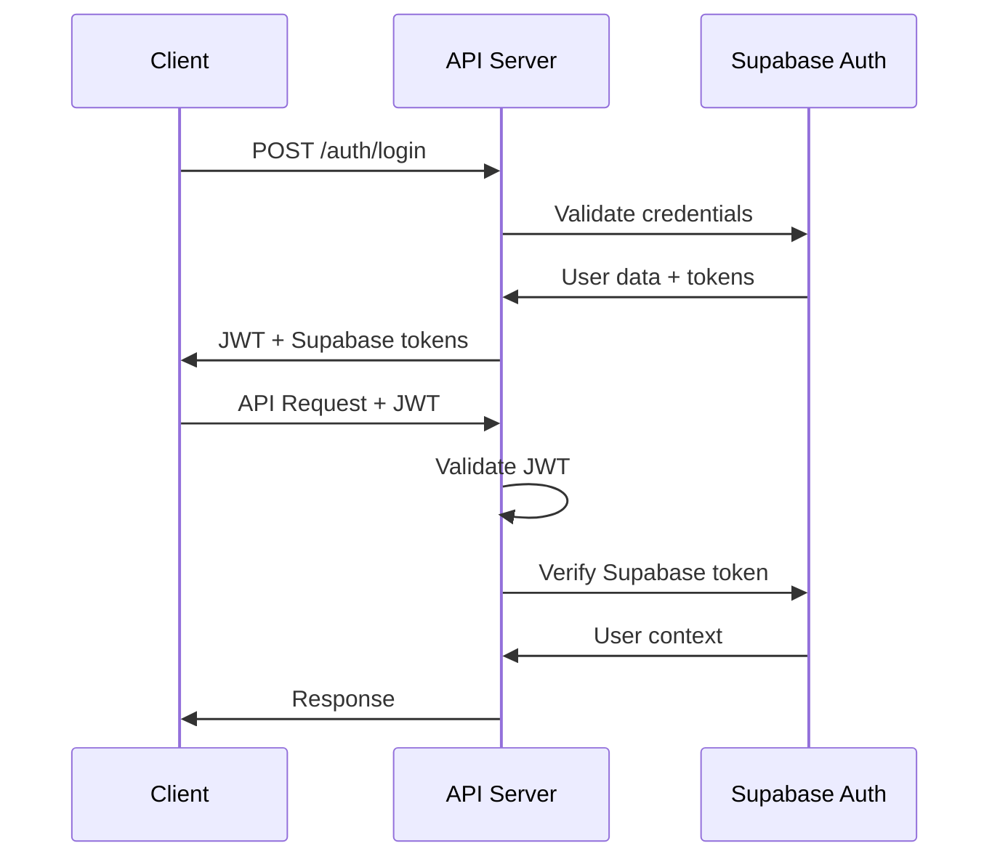

# 🚀 Script Labs App - API Documentation V2.0

## 📋 Document Information

- **Version**: 2.0
- **Date**: July 29, 2025
- **Status**: API Specification
- **Related**: [PRD V2.0](./PRD_Script_Labs_V2.md), [Implementation Architecture](./IMPLEMENTATION_ARCHITECTURE.md)

---

## 🎯 API Overview

Script Labs V2 RESTful API provides comprehensive endpoints for lab management, enhanced search capabilities, user authentication, and password recovery with full Supabase integration.

### **Base URL**

**Production**: `https://script-labs-app.onrender.com/api`
**Staging**: `https://staging-script-labs.onrender.com/api`

### **API Characteristics**

**Environment**: `Script-Labs-Environment.postman_environment.json`

- **Authentication**: JWT + Supabase Auth
- **Rate Limiting**: Implemented per endpoint
- **Versioning**: Via header or URL path
- **CORS**: Enabled for frontend domains

---

## 🔐 Authentication

### **Authentication Flow**



### **Authentication Headers**

```http
Authorization: Bearer <jwt_token>
X-Supabase-Token: <supabase_access_token>
Content-Type: application/json
```

---

## 📚 lab Management Endpoints

### **1. Get All labs**

**Endpoint**: `GET /api/labs`

**Description**: Retrieve user's labs with optional pagination and basic filtering.

**Headers**:

```http
Authorization: Bearer <token>
```

**Query Parameters**:

```javascript
{
  page: number,          // Page number (default: 1)
  limit: number,         // Items per page (default: 10, max: 50)
  sort_by: string,       // Sort field: title|author|created_at|rating
  sort_order: string,    // Sort order: asc|desc (default: desc)
  category: string,      // Filter by category
  reading_status: string // Filter by status: to_read|reading|read
}
```

**Response**:

```javascript
{
  "success": true,
  "data": {
    "labs": [
      {
        "id": "uuid",
        "title": "Clean Code",
        "author": "Robert C. Martin",
        "category": "Technical",
        "publication_year": 2008,
        "isbn": "9780132350884",
        "rating": 5,
        "reading_status": "read",
        "notes": "Excellent lab about writing maintainable code",
        "cover_url": "https://example.com/cover.jpg",
        "created_at": "2025-07-29T10:00:00Z",
        "updated_at": "2025-07-29T10:00:00Z"
      }
    ],
    "pagination": {
      "current_page": 1,
      "per_page": 10,
      "total_results": 25,
      "total_pages": 3
    }
  }
}
```

**Error Responses**:

```javascript
// 401 Unauthorized
{
  "success": false,
  "message": "Authentication required",
  "error_code": "AUTH_REQUIRED"
}

// 400 Bad Request
{
  "success": false,
  "message": "Invalid pagination parameters",
  "errors": [
    {
      "field": "page",
      "message": "Page must be a positive integer"
    }
  ]
}
```

---

### **2. Advanced Search labs**

**Endpoint**: `GET /api/labs/search`

**Description**: Advanced search with full-text search, filtering, and performance metrics.

**Headers**:

```http
Authorization: Bearer <token>
```

**Query Parameters**:

```javascript
{
  q: string,             // Search query for title/author/notes
  category: string,      // Filter by category
  reading_status: string,// Filter by reading status
  rating_min: number,    // Minimum rating (1-5)
  rating_max: number,    // Maximum rating (1-5)
  year_from: number,     // Publication year from
  year_to: number,       // Publication year to
  sort_by: string,       // Sort field
  sort_order: string,    // Sort order
  page: number,          // Page number
  limit: number          // Items per page (max: 50)
}
```

**Example Request**:

```http
GET /api/labs/search?q=javascript&category=Technical&rating_min=4&sort_by=rating&sort_order=desc&page=1&limit=10
```

**Response**:

```javascript
{
  "success": true,
  "data": {
    "labs": [
      {
        "id": "uuid",
        "title": "JavaScript: The Good Parts",
        "author": "Douglas Crockford",
        "category": "Technical",
        "publication_year": 2008,
        "rating": 5,
        "reading_status": "read",
        "search_rank": 0.9876,  // Search relevance score
        "created_at": "2025-07-29T10:00:00Z"
      }
    ],
    "pagination": {
      "current_page": 1,
      "per_page": 10,
      "total_results": 5,
      "total_pages": 1
    },
    "search_query": "javascript",
    "filters_applied": {
      "category": "Technical",
      "rating_min": 4,
      "sort_by": "rating",
      "sort_order": "desc"
    }
  },
  "performance": {
    "query_time_ms": 45,
    "results_count": 5,
    "search_explanation": "Full-text search with filters"
  }
}
```

---

### **3. Create lab**

**Endpoint**: `POST /api/labs`

**Description**: Create a new lab in user's catalog.

**Headers**:

```http
Authorization: Bearer <token>
Content-Type: application/json
```

**Request Body**:

```javascript
{
  "title": "Clean Architecture",           // Required, max 500 chars
  "author": "Robert C. Martin",          // Required, max 300 chars
  "category": "Technical",               // Optional, max 100 chars
  "publication_year": 2017,              // Optional, valid year
  "isbn": "9780134494166",               // Optional, valid ISBN format
  "rating": 5,                           // Optional, 1-5 integer
  "reading_status": "reading",           // Optional: to_read|reading|read
  "notes": "Great insights on architecture", // Optional, max 5000 chars
  "cover_url": "https://example.com/cover.jpg" // Optional, valid URL
}
```

**Response**:

```javascript
{
  "success": true,
  "data": {
    "id": "generated-uuid",
    "title": "Clean Architecture",
    "author": "Robert C. Martin",
    "category": "Technical",
    "publication_year": 2017,
    "isbn": "9780134494166",
    "rating": 5,
    "reading_status": "reading",
    "notes": "Great insights on architecture",
    "cover_url": "https://example.com/cover.jpg",
    "user_id": "user-uuid",
    "created_at": "2025-07-29T10:00:00Z",
    "updated_at": "2025-07-29T10:00:00Z"
  },
  "message": "lab created successfully"
}
```

**Validation Errors**:

```javascript
{
  "success": false,
  "message": "Validation failed",
  "errors": [
    {
      "field": "title",
      "message": "Title is required and must be 1-500 characters"
    },
    {
      "field": "rating",
      "message": "Rating must be between 1 and 5"
    },
    {
      "field": "isbn",
      "message": "ISBN must be in valid format (10 or 13 digits)"
    }
  ]
}
```

---

### **4. Update lab**

**Endpoint**: `PUT /api/labs/:id`

**Description**: Update an existing lab in user's catalog.

**Headers**:

```http
Authorization: Bearer <token>
Content-Type: application/json
```

**Path Parameters**:

- `id`: lab UUID

**Request Body**: Same as Create lab (all fields optional for update)

**Response**:

```javascript
{
  "success": true,
  "data": {
    // Updated lab object
  },
  "message": "lab updated successfully"
}
```

**Error Responses**:

```javascript
// 404 Not Found
{
  "success": false,
  "message": "lab not found or access denied",
  "error_code": "LAB_NOT_FOUND"
}
```

---

### **5. Delete lab**

**Endpoint**: `DELETE /api/labs/:id`

**Description**: Delete a lab from user's catalog.

**Headers**:

```http
Authorization: Bearer <token>
```

**Path Parameters**:

- `id`: lab UUID

**Response**:

```javascript
{
  "success": true,
  "message": "lab deleted successfully"
}
```

---

### **6. Bulk Operations**

**Endpoint**: `GET /api/labs/search`

**Description**: Search labs by title or author for the authenticated user.

**Headers**:

```http
Authorization: Bearer <token>
```

**Query Parameters**:

```javascript
{
  q: string,      // Search query for title/author
  page: number,   // Page number (default: 1)
  limit: number   // Items per page (default: 10, max: 100)
}
```

**Example Request**:

```
GET /api/labs/search?q=atomic&page=1&limit=10
```

**Response**:

```javascript
{
  "success": true,
  "data": [
    { "id": 14, "title": "Atomic Habits", "author": "James Clear", "user_id": "..." }
  ],
  "pagination": { "page": 1, "limit": 10, "total": 1, "totalPages": 1 },
  "search_query": "atomic",
  "timestamp": "2025-07-31T10:00:00.000Z"
}
```

}

````

2. **Update Category**:
```javascript
{
  "action": "update_category",
  "lab_ids": ["uuid1", "uuid2"],
  "data": { "category": "Fiction" }
}
````

3. **Bulk Delete**:

```javascript
{
  "action": "delete",
  "lab_ids": ["uuid1", "uuid2"]
}
```

**Response**:

```javascript
{
  "success": true,
  "data": {
    "total_processed": 3,
    "successful": 2,
    "failed": 1,
    "results": [
      {
        "id": "uuid1",
        "success": true,
        "data": { /* updated lab object */ }
      },
      {
        "id": "uuid2",
        "success": true,
        "data": { /* updated lab object */ }
      },
      {
        "id": "uuid3",
        "success": false,
        "error": "lab not found"
      }
    ]
  },
  "message": "Bulk update_status completed: 2 successful, 1 failed"
}
```

---

## 🔐 Authentication Endpoints

### **1. User Registration**

**Endpoint**: `POST /api/auth/register`

**Description**: Register a new user account.

**Request Body**:

```javascript
{
  "email": "user@example.com",       // Required, valid email
  "password": "SecurePass123!",      // Required, min 8 chars with complexity
  "name": "John Doe"                 // Optional, display name
}
```

**Response**:

```javascript
{
  "success": true,
  "data": {
    "user": {
      "id": "user-uuid",
      "email": "user@example.com",
      "name": "John Doe"
    }
  },
  "message": "User registered successfully"
}
```

**Password Requirements**:

- Minimum 8 characters
- At least one uppercase letter
- At least one lowercase letter
- At least one number
- At least one special character (@$!%\*?&)

---

### **2. User Login**

**Endpoint**: `POST /api/auth/login`

**Description**: Authenticate user and receive tokens.

**Request Body**:

```javascript
{
  "email": "user@example.com",
  "password": "SecurePass123!"
}
```

**Response**:

```javascript
{
  "success": true,
  "data": {
    "user": {
      "id": "user-uuid",
      "email": "user@example.com",
      "name": "John Doe"
    },
    "tokens": {
      "access_token": "jwt-token-here",
      "supabase_token": "supabase-access-token",
      "refresh_token": "refresh-token-here"
    }
  },
  "message": "Login successful"
}
```

---

### **3. Forgot Password Request**

**Endpoint**: `POST /api/auth/forgot-password`

**Description**: Request password reset email.

**Rate Limiting**: 3 requests per hour per email/IP

**Request Body**:

```javascript
{
  "email": "user@example.com"
}
```

**Response** (Always returns success to prevent email enumeration):

```javascript
{
  "success": true,
  "message": "Password reset email sent if account exists",
  "rate_limit": {
    "remaining_attempts": 2,
    "reset_time": "2025-07-29T11:00:00Z"
  }
}
```

**Rate Limit Error**:

```javascript
{
  "success": false,
  "message": "Too many password reset attempts, please try again later.",
  "error_code": "RATE_LIMIT_EXCEEDED",
  "retry_after": 3600
}
```

---

### **4. Validate Reset Token**

**Endpoint**: `GET /api/auth/reset-password/:token`

**Description**: Validate password reset token.

**Path Parameters**:

- `token`: Password reset token from email

**Response**:

```javascript
{
  "success": true,
  "data": {
    "token_valid": true,
    "expires_at": "2025-07-29T11:00:00Z",
    "email": "u***@example.com"  // Masked email
  }
}
```

**Invalid Token**:

```javascript
{
  "success": false,
  "message": "Invalid or expired reset token",
  "error_code": "INVALID_TOKEN"
}
```

---

### **5. Reset Password**

**Endpoint**: `POST /api/auth/reset-password`

**Description**: Complete password reset process.

**Request Body**:

```javascript
{
  "token": "reset-token-from-email",
  "new_password": "NewSecurePass123!"
}
```

**Response**:

```javascript
{
  "success": true,
  "message": "Password successfully updated"
}
```

**Validation Errors**:

```javascript
{
  "success": false,
  "message": "Password reset validation failed",
  "errors": [
    {
      "field": "new_password",
      "message": "Password must be 8-128 characters with uppercase, lowercase, number, and special character"
    },
    {
      "field": "token",
      "message": "Invalid reset token"
    }
  ]
}
```

---

## 📊 User Statistics Endpoints

### **1. Get User lab Statistics**

**Endpoint**: `GET /api/users/stats`

**Description**: Get comprehensive statistics about user's lab collection.

**Headers**:

```http
Authorization: Bearer <token>
```

**Response**:

```javascript
{
  "success": true,
  "data": {
    "total_labs": 127,
    "labs_read": 89,
    "labs_reading": 5,
    "labs_to_read": 33,
    "average_rating": 4.2,
    "total_authors": 76,
    "total_categories": 12,
    "reading_stats": {
      "labs_this_year": 28,
      "labs_this_month": 3,
      "favorite_category": "Technical",
      "most_read_author": "Robert C. Martin"
    },
    "category_breakdown": [
      { "category": "Technical", "count": 45 },
      { "category": "Fiction", "count": 32 },
      { "category": "Biography", "count": 18 }
    ]
  }
}
```

---

## 🔍 Search Analytics Endpoints

### **1. Popular Search Terms**

**Endpoint**: `GET /api/search/popular`

**Description**: Get popular search terms (aggregated anonymously).

**Headers**:

```http
Authorization: Bearer <token>
```

**Response**:

```javascript
{
  "success": true,
  "data": {
    "popular_searches": [
      { "term": "javascript", "count": 156 },
      { "term": "python", "count": 142 },
      { "term": "design patterns", "count": 98 }
    ],
    "trending_categories": [
      { "category": "Technical", "growth": 15.2 },
      { "category": "Self-Help", "growth": 8.7 }
    ]
  }
}
```

---

## âš¡ Performance & Health Endpoints

### **1. API Health Check**

**Endpoint**: `GET /api/health`

**Description**: Check API health status.

**No Authentication Required**

**Response**:

```javascript
{
  "success": true,
  "status": "healthy",
  "timestamp": "2025-07-29T10:00:00Z",
  "version": "2.0.0",
  "services": {
    "database": "healthy",
    "supabase": "healthy",
    "email": "healthy",
    "telegram": "healthy"
  },
  "performance": {
    "uptime": "7d 12h 34m",
    "response_time_ms": 12,
    "memory_usage": "145MB",
    "active_connections": 23
  }
}
```

### **2. API Metrics**

**Endpoint**: `GET /api/metrics`

**Description**: Get API performance metrics (admin only).

**Headers**:

```http
Authorization: Bearer <admin_token>
```

**Response**:

```javascript
{
  "success": true,
  "data": {
    "requests": {
      "total": 125847,
      "today": 1247,
      "per_hour": 52
    },
    "performance": {
      "avg_response_time": 89,
      "p95_response_time": 245,
      "error_rate": 0.02
    },
    "endpoints": [
      {
        "path": "/api/labs/search",
        "count": 45231,
        "avg_time": 156
      }
    ]
  }
}
```

---

## 🚨 Error Handling

### **Standard Error Response Format**

```javascript
{
  "success": false,
  "message": "Human-readable error message",
  "error_code": "MACHINE_READABLE_CODE",
  "errors": [                    // For validation errors
    {
      "field": "field_name",
      "message": "Field-specific error message"
    }
  ],
  "timestamp": "2025-07-29T10:00:00Z",
  "request_id": "uuid-for-tracking"
}
```

### **HTTP Status Codes**

| Status Code | Meaning               | Usage                                            |
| ----------- | --------------------- | ------------------------------------------------ |
| 200         | OK                    | Successful GET, PUT requests                     |
| 201         | Created               | Successful POST requests                         |
| 400         | Bad Request           | Validation errors, malformed requests            |
| 401         | Unauthorized          | Authentication required or failed                |
| 403         | Forbidden             | Access denied (authenticated but not authorized) |
| 404         | Not Found             | Resource not found or access denied              |
| 409         | Conflict              | Resource already exists (e.g., duplicate email)  |
| 422         | Unprocessable Entity  | Semantic validation errors                       |
| 429         | Too Many Requests     | Rate limit exceeded                              |
| 500         | Internal Server Error | Server errors                                    |
| 503         | Service Unavailable   | Temporary server issues                          |

### **Common Error Codes**

```javascript
// Authentication Errors
"AUTH_REQUIRED"; // No token provided
"AUTH_INVALID"; // Invalid token
"AUTH_EXPIRED"; // Token expired
"ACCESS_DENIED"; // Insufficient permissions

// Validation Errors
"VALIDATION_FAILED"; // Request validation failed
"INVALID_FORMAT"; // Data format errors
"REQUIRED_FIELD"; // Missing required fields

// Resource Errors
"RESOURCE_NOT_FOUND"; // Resource doesn't exist
"RESOURCE_EXISTS"; // Resource already exists
"RESOURCE_LIMIT"; // Resource limit exceeded

// Rate Limiting
"RATE_LIMIT_EXCEEDED"; // Too many requests
"QUOTA_EXCEEDED"; // Usage quota exceeded

// System Errors
"DATABASE_ERROR"; // Database connection issues
"SERVICE_UNAVAILABLE"; // External service down
"INTERNAL_ERROR"; // Generic server error
```

---

## 🔧 Rate Limiting

### **Rate Limit Headers**

```http
X-RateLimit-Limit: 100
X-RateLimit-Remaining: 97
X-RateLimit-Reset: 1690629600
X-RateLimit-Window: 900
```

### **Rate Limits by Endpoint**

| Endpoint                    | Limit | Window | Notes          |
| --------------------------- | ----- | ------ | -------------- |
| `/api/auth/login`           | 10    | 15 min | Per IP address |
| `/api/auth/register`        | 5     | 1 hour | Per IP address |
| `/api/auth/forgot-password` | 3     | 1 hour | Per email/IP   |
| `/api/labs/search`          | 100   | 15 min | Per user       |
| `/api/labs/*`               | 200   | 15 min | Per user       |
| `/api/*` (general)          | 1000  | 15 min | Per user       |

---

## 📈 API Versioning

### **Current Version**: v2.0

### **Versioning Strategy**

1. **Header-based versioning** (preferred):

```http
API-Version: 2.0
```

2. **URL-based versioning** (fallback):

```http
GET /api/v2/labs
```

### **Version Compatibility**

- **v1.x**: Legacy support (deprecated, remove 2026-01-01)
- **v2.0**: Current version with enhanced features
- **v2.x**: Future minor updates (backward compatible)

---

## 🧪 Testing the API

### **Using cURL**

```bash
# Login
curl -X POST https://api.scriptlabs.com/api/auth/login \
  -H "Content-Type: application/json" \
  -d '{"email":"user@example.com","password":"password"}'

# Search labs
curl -X GET "https://api.scriptlabs.com/api/labs/search?q=javascript&limit=5" \
  -H "Authorization: Bearer <token>"

# Create lab
curl -X POST https://api.scriptlabs.com/api/labs \
  -H "Authorization: Bearer <token>" \
  -H "Content-Type: application/json" \
  -d '{"title":"New lab","author":"Author Name"}'
```

### **Postman Collection**

A comprehensive Postman collection is available at:

- **File**: `Script_Labs_API_v2.postman_collection.json`
- **Environment**: `lab-Catalog-Environment.postman_environment.json`

---

## 📋 API Development Guidelines

### **Request/Response Best Practices**

1. **Use consistent naming**: `snake_case` for JSON fields
2. **Include timestamps**: ISO 8601 format with timezone
3. **Provide pagination**: For all list endpoints
4. **Return complete objects**: After create/update operations
5. **Use appropriate HTTP methods**: GET, POST, PUT, DELETE
6. **Include performance metrics**: For search operations

### **Security Considerations**

1. **Always validate input**: Server-side validation required
2. **Sanitize output**: Prevent XSS in responses
3. **Rate limiting**: Protect against abuse
4. **Authentication**: Required for all user data endpoints
5. **Authorization**: Check user permissions for all operations
6. **Audit logging**: Log sensitive operations

---

## 🎯 API Roadmap

### **Planned Enhancements (v2.1)**

- GraphQL endpoint for flexible queries
- WebSocket support for real-time updates
- Advanced analytics endpoints
- lab recommendation engine
- Social features (sharing, reviews)

### **Future Considerations (v3.0)**

- Microservices architecture
- API gateway implementation
- Advanced caching strategies
- Machine learning integrations

---

**Document Status**: ✅ Complete  
**Last Updated**: July 29, 2025  
**API Version**: 2.0  
**Next Review**: Monthly during active development
