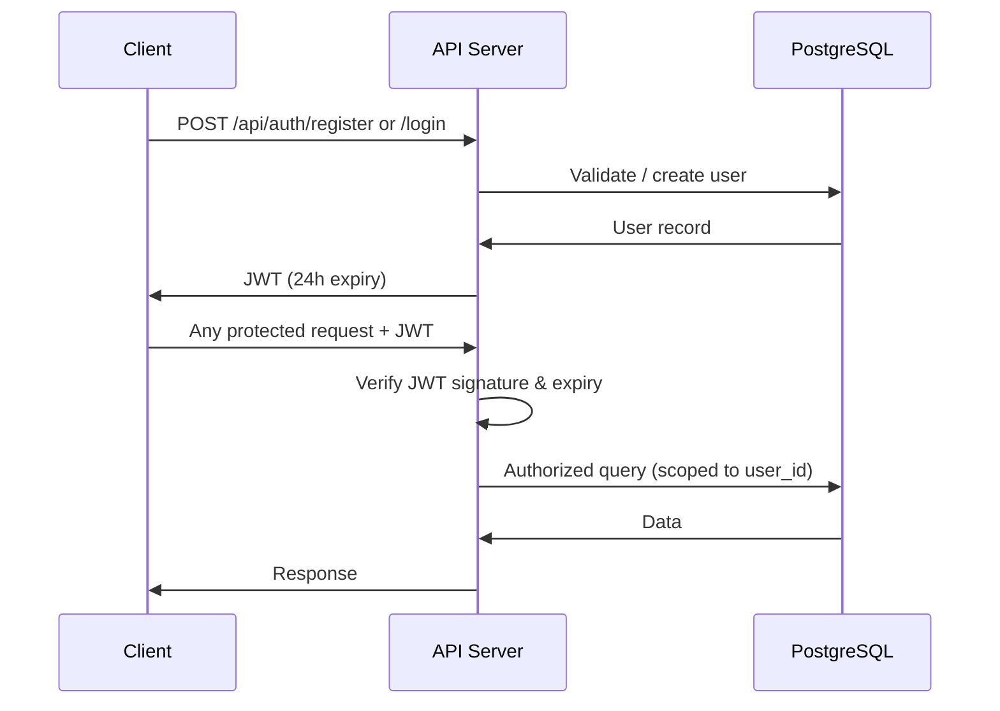

# 🚀 Script Labs App - API Documentation V2.0

## 📋 Document Information

- **Version**: 2.0 (rewritten to match the actual implemented API — see `backend/routes/*.js`)
- **Date**: 13 September 2026
- **Status**: Current / Authoritative
- **Related**: [PRD V2.0](./PRD_Script_Labs_V2.md), [Database Architecture](./DATABASE_ARCHITECTURE_V2.md)

> This document lists **only endpoints that actually exist in the codebase**. Earlier drafts referenced forgot-password, Supabase auth, book ratings/ISBN, bulk operations, and admin/metrics endpoints — none of those exist. Do not build automation or test cases against them.

---

## 🎯 API Overview

Script Labs is a stateless REST API. There is **no frontend served by this backend** — it is API-only, intended as a practice target for QA automation and performance testing.

### Base URL

Configure this per environment (local dev, or your deployed Vultr instance):

```
http://localhost:3000/api          (local dev)
https://<your-domain>/api          (deployed)
```

### API Characteristics

- **Authentication**: JWT only (`Authorization: Bearer <token>`), no third-party auth
- **Content-Type**: `application/json` for all request/response bodies
- **Rate Limiting**: only on `/api/auth/register` and `/api/auth/login` (5 requests / 15 minutes / IP)
- **Interactive docs**: Swagger UI at `/api-docs` (see [SWAGGER_UI_GUIDE.md](./SWAGGER_UI_GUIDE.md))

---

## 🔐 Authentication

### Authentication Flow


```mermaid
sequenceDiagram
    participant C as Client
    participant API as API Server
    participant DB as PostgreSQL

    C->>API: POST /api/auth/register or /login
    API->>DB: Validate / create user
    DB->>API: User record
    API->>C: JWT (24h expiry)

    C->>API: Any protected request + JWT
    API->>API: Verify JWT signature & expiry
    API->>DB: Authorized query (scoped to user_id)
    DB->>API: Data
    API->>C: Response
```

### Authentication Header

```http
Authorization: Bearer <jwt_token>
```

There is no separate "Supabase token" or refresh token — a single JWT (default 24h expiry) is the entire auth mechanism.

---

## 🔑 Auth Endpoints (`/api/auth`)

### 1. Register

**`POST /api/auth/register`** — public, rate-limited (5/15min/IP)

**Request Body**

```json
{
  "email": "user@example.com",
  "password": "at-least-6-chars"
}
```

**201 Created**

```json
{
  "success": true,
  "message": "User registered successfully",
  "data": {
    "token": "eyJhbGciOi...",
    "user": { "id": 1, "email": "user@example.com", "role": "user", "status": "active" },
    "requiresConfirmation": false
  },
  "timestamp": "2026-09-13T10:00:00.000Z"
}
```

**409 Conflict** — email already registered

```json
{
  "success": false,
  "error": { "message": "Email already registered", "code": "EMAIL_EXISTS" },
  "timestamp": "2026-09-13T10:00:00.000Z"
}
```

**400 Bad Request** — validation failure (missing/invalid email, password < 6 or > 128 chars)

```json
{
  "success": false,
  "status": "fail",
  "error": { "message": "Validation Error: Password must be at least 6 characters long" },
  "timestamp": "2026-09-13T10:00:00.000Z",
  "path": "/api/auth/register",
  "method": "POST"
}
```

**429 Too Many Requests** — more than 5 attempts / 15 min from the same IP

```json
{
  "success": false,
  "error": {
    "message": "Too many authentication attempts. Please try again later",
    "code": "RATE_LIMIT_EXCEEDED",
    "retryAfter": 900
  },
  "timestamp": "2026-09-13T10:00:00.000Z"
}
```

---

### 2. Login

**`POST /api/auth/login`** — public, rate-limited (5/15min/IP)

**Request Body**

```json
{ "email": "user@example.com", "password": "at-least-6-chars" }
```

**200 OK**

```json
{
  "success": true,
  "message": "Login successful",
  "data": {
    "token": "eyJhbGciOi...",
    "user": { "id": 1, "email": "user@example.com", "role": "user", "status": "active" }
  },
  "timestamp": "2026-09-13T10:00:00.000Z"
}
```

**401 Unauthorized** — wrong email OR wrong password (same message for both, by design — anti user-enumeration)

```json
{
  "success": false,
  "error": { "message": "Invalid email or password", "code": "AUTH_FAILED" },
  "timestamp": "2026-09-13T10:00:00.000Z"
}
```

**403 Forbidden** — account `status` is `"locked"`

```json
{
  "success": false,
  "error": { "message": "User account is locked", "code": "USER_LOCKED" },
  "timestamp": "2026-09-13T10:00:00.000Z"
}
```

**400 / 429** — same shapes as Register above.

---

### 3. Logout

**`POST /api/auth/logout`** — public (no token required)

**200 OK**

```json
{
  "success": true,
  "message": "Logout successful. Remove the token on the client side.",
  "data": { "note": "This API uses stateless JWT auth." },
  "timestamp": "2026-09-13T10:00:00.000Z"
}
```

---

### 4. Get Current User

**`GET /api/auth/me`** — requires `Authorization: Bearer <token>`

**200 OK**

```json
{
  "success": true,
  "data": { "user": { "id": 1, "email": "user@example.com", "role": "user", "status": "active", "created_at": "..." } },
  "timestamp": "2026-09-13T10:00:00.000Z"
}
```

**401 Unauthorized** (missing/invalid/expired token) — note this error shape comes from the auth middleware, not the standard error envelope:

```json
{ "message": "No token provided" }
```
or `{ "message": "Invalid token format" }` or `{ "message": "Invalid token" }`.

---

### 5. Verify Token

**`POST /api/auth/verify-token`** — requires `Authorization: Bearer <token>`

**200 OK**

```json
{
  "success": true,
  "data": { "valid": true, "user_id": 1, "email": "user@example.com", "expires_at": 1234567890 },
  "message": "Token is valid",
  "timestamp": "2026-09-13T10:00:00.000Z"
}
```

**401 Unauthorized** — same shape as `/me` above.

---

## 📚 Lab Endpoints (`/api/labs`)

All endpoints below require `Authorization: Bearer <token>`. A user only ever sees/modifies their own labs.

### 1. List Labs

**`GET /api/labs`**

**Query Parameters**

| Param | Type | Default | Notes |
|-------|------|---------|-------|
| `page` | integer | 1 | |
| `limit` | integer | 50 | capped at 100 |
| `search` | string | – | matches `title` OR `description`, case-insensitive |

**200 OK**

```json
{
  "success": true,
  "data": [
    { "id": 1, "title": "Lab Menari", "description": "Belajar menari", "user_id": 1, "created_at": "...", "updated_at": "..." }
  ],
  "pagination": { "page": 1, "limit": 50, "total": 1, "totalPages": 1 },
  "timestamp": "2026-09-13T10:00:00.000Z"
}
```

### 2. Search Labs

**`GET /api/labs/search`**

Same as above but the query param is `q` instead of `search`, default `limit` is 10, and the response also echoes `search_query`.

```
GET /api/labs/search?q=menari&page=1&limit=10
```

### 3. Get One Lab

**`GET /api/labs/:id`**

**200 OK** — the lab object. **404 Not Found** if it doesn't exist or belongs to another user.

### 4. Create Lab

**`POST /api/labs`**

**Request Body**

```json
{ "title": "Lab Baru", "description": "Deskripsi lab, 1-1000 karakter" }
```

**201 Created** — the created lab. **409 Conflict** if an identical `title`+`description` already exists for this user. **400 Bad Request** on validation failure.

### 5. Update Lab

**`PUT /api/labs/:id`**

**Request Body** (at least one field required)

```json
{ "title": "Judul Baru" }
```

**200 OK** — updated lab. **400** if body has no valid fields. **404** if not found/not owned.

### 6. Delete Lab

**`DELETE /api/labs/:id`**

**200 OK**

```json
{ "success": true, "data": { "id": "3" }, "message": "lab deleted successfully", "timestamp": "..." }
```

**404** if not found/not owned.

---

## 🩺 Utility Endpoints

### Health Check

**`GET /health`** — no auth required.

```json
{ "success": true, "message": "Server is healthy", "timestamp": "...", "version": "1.0.0", "nodeEnv": "production" }
```

### API Docs

**`GET /api-docs`** — Swagger UI (interactive).

---

## 🚨 Error Handling

There are **two different error response shapes** in this API — this is a real, current characteristic of the implementation, not a documentation choice, and QA should write contract tests that catch a regression either way:

**Shape A — business-logic errors returned directly by a route** (e.g. `EMAIL_EXISTS`, `AUTH_FAILED`, `USER_LOCKED`, rate-limit errors):

```json
{ "success": false, "error": { "message": "...", "code": "..." }, "timestamp": "..." }
```

**Shape B — errors thrown to the centralized error handler** (validation errors, unexpected 500s):

```json
{ "success": false, "status": "fail", "error": { "message": "..." }, "timestamp": "...", "path": "...", "method": "..." }
```

**Shape C — auth middleware failures** (`/me`, `/verify-token`, any `/api/labs/*` call with a bad token):

```json
{ "message": "No token provided" }
```

### HTTP Status Codes Used

| Status | Meaning | Used for |
|--------|---------|----------|
| 200 | OK | Successful GET/PUT/DELETE |
| 201 | Created | Successful POST (register, create lab) |
| 400 | Bad Request | Validation errors |
| 401 | Unauthorized | Missing/invalid/expired token, wrong login credentials |
| 403 | Forbidden | Locked account |
| 404 | Not Found | Resource doesn't exist or isn't owned by the caller |
| 409 | Conflict | Duplicate email, duplicate lab |
| 429 | Too Many Requests | Rate limit exceeded (auth endpoints only) |
| 500 | Internal Server Error | Unexpected server/database failure |

---

## 🔧 Rate Limiting

| Endpoint | Limit | Window | Applies in |
|----------|-------|--------|------------|
| `POST /api/auth/register` | 5 | 15 min per IP | all environments except `NODE_ENV=test` |
| `POST /api/auth/login` | 5 | 15 min per IP | all environments except `NODE_ENV=test` |
| `/api/labs/*` | none | – | not rate-limited |

Rate-limit responses include a `RateLimit-*` header set (`standardHeaders: true`) and a JSON body with `retryAfter` in seconds.

---

## 🧪 Testing the API

### Using cURL

```bash
# Register
curl -X POST http://localhost:3000/api/auth/register \
  -H "Content-Type: application/json" \
  -d '{"email":"qa@example.com","password":"testpass123"}'

# Login
curl -X POST http://localhost:3000/api/auth/login \
  -H "Content-Type: application/json" \
  -d '{"email":"qa@example.com","password":"testpass123"}'

# List labs
curl -X GET "http://localhost:3000/api/labs?page=1&limit=10" \
  -H "Authorization: Bearer <token>"

# Create a lab
curl -X POST http://localhost:3000/api/labs \
  -H "Authorization: Bearer <token>" \
  -H "Content-Type: application/json" \
  -d '{"title":"New Lab","description":"A description"}'
```

### Postman

A Postman collection lives under `postman/` in this repository — import it alongside an environment that defines `BASE_URL_LOCAL` (or your deployed base URL).

---

**Document Status**: ✅ Complete
**Last Updated**: 13 September 2026
**API Version**: 2.0
