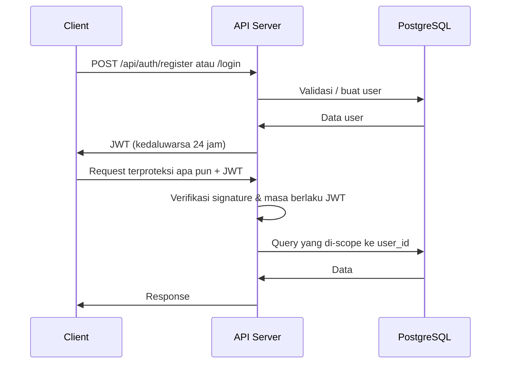

# 🚀 Script Labs App - Dokumentasi API V2.0

## 📋 Informasi Dokumen

- **Versi**: 2.0 (ditulis ulang agar sesuai dengan API yang benar-benar diimplementasikan — lihat `backend/routes/*.js`)
- **Tanggal**: 13 September 2026
- **Status**: Aktif / Acuan Utama
- **Terkait**: [PRD V2.0](./PRD_Script_Labs_V2.md), [Arsitektur Database](./DATABASE_ARCHITECTURE_V2.md)

> Dokumen ini hanya mendaftar endpoint yang **benar-benar ada di codebase**. Draf sebelumnya menyebut lupa password, auth Supabase, rating/ISBN buku, operasi bulk, dan endpoint admin/metrics — semua itu tidak ada. Jangan membangun automation atau test case terhadap fitur-fitur tersebut.

---

## 🎯 Gambaran API

Script Labs adalah REST API stateless. **Tidak ada frontend** yang disajikan oleh backend ini — murni API, ditujukan sebagai target latihan untuk automation dan performance testing QA.

### Base URL

Sesuaikan per environment (dev lokal, atau instance Vultr yang sudah di-deploy):

```
http://localhost:3000/api          (dev lokal)
https://<domain-kamu>/api          (deployed)
```

### Karakteristik API

- **Autentikasi**: JWT saja (`Authorization: Bearer <token>`), tidak ada auth pihak ketiga
- **Content-Type**: `application/json` untuk semua body request/response
- **Rate Limiting**: hanya di `/api/auth/register` dan `/api/auth/login` (5 request / 15 menit / IP)
- **Dokumentasi interaktif**: Swagger UI di `/api-docs` (lihat [SWAGGER_UI_GUIDE.md](./SWAGGER_UI_GUIDE.md))

---

## 🔐 Autentikasi

### Alur Autentikasi


```mermaid
sequenceDiagram
    participant C as Client
    participant API as API Server
    participant DB as PostgreSQL

    C->>API: POST /api/auth/register atau /login
    API->>DB: Validasi / buat user
    DB->>API: Data user
    API->>C: JWT (kedaluwarsa 24 jam)

    C->>API: Request terproteksi apa pun + JWT
    API->>API: Verifikasi signature & masa berlaku JWT
    API->>DB: Query yang di-scope ke user_id
    DB->>API: Data
    API->>C: Response
```

### Header Autentikasi

```http
Authorization: Bearer <jwt_token>
```

Tidak ada "Supabase token" atau refresh token terpisah — satu JWT (default kedaluwarsa 24 jam) adalah keseluruhan mekanisme auth.

---

## 🔑 Endpoint Auth (`/api/auth`)

### 1. Register

**`POST /api/auth/register`** — publik, dibatasi rate limit (5/15menit/IP)

**Request Body**

```json
{
  "email": "user@example.com",
  "password": "minimal-6-karakter"
}
```

**201 Created**

```json
{
  "success": true,
  "message": "User registered successfully",
  "data": {
    "token": "eyJhbGciOi...",
    "user": { "id": 1, "email": "user@example.com", "role": "user", "status": "active" },
    "requiresConfirmation": false
  },
  "timestamp": "2026-09-13T10:00:00.000Z"
}
```

**409 Conflict** — email sudah terdaftar

```json
{
  "success": false,
  "error": { "message": "Email already registered", "code": "EMAIL_EXISTS" },
  "timestamp": "2026-09-13T10:00:00.000Z"
}
```

**400 Bad Request** — gagal validasi (email kosong/tidak valid, password < 6 atau > 128 karakter)

```json
{
  "success": false,
  "status": "fail",
  "error": { "message": "Validation Error: Password must be at least 6 characters long" },
  "timestamp": "2026-09-13T10:00:00.000Z",
  "path": "/api/auth/register",
  "method": "POST"
}
```

**429 Too Many Requests** — lebih dari 5 percobaan / 15 menit dari IP yang sama

```json
{
  "success": false,
  "error": {
    "message": "Too many authentication attempts. Please try again later",
    "code": "RATE_LIMIT_EXCEEDED",
    "retryAfter": 900
  },
  "timestamp": "2026-09-13T10:00:00.000Z"
}
```

---

### 2. Login

**`POST /api/auth/login`** — publik, dibatasi rate limit (5/15menit/IP)

**Request Body**

```json
{ "email": "user@example.com", "password": "minimal-6-karakter" }
```

**200 OK**

```json
{
  "success": true,
  "message": "Login successful",
  "data": {
    "token": "eyJhbGciOi...",
    "user": { "id": 1, "email": "user@example.com", "role": "user", "status": "active" }
  },
  "timestamp": "2026-09-13T10:00:00.000Z"
}
```

**401 Unauthorized** — email salah ATAU password salah (pesan sama untuk keduanya, memang disengaja — anti user-enumeration)

```json
{
  "success": false,
  "error": { "message": "Invalid email or password", "code": "AUTH_FAILED" },
  "timestamp": "2026-09-13T10:00:00.000Z"
}
```

**403 Forbidden** — akun berstatus `"locked"`

```json
{
  "success": false,
  "error": { "message": "User account is locked", "code": "USER_LOCKED" },
  "timestamp": "2026-09-13T10:00:00.000Z"
}
```

**400 / 429** — bentuk sama seperti Register di atas.

---

### 3. Logout

**`POST /api/auth/logout`** — publik (tidak butuh token)

**200 OK**

```json
{
  "success": true,
  "message": "Logout successful. Remove the token on the client side.",
  "data": { "note": "This API uses stateless JWT auth." },
  "timestamp": "2026-09-13T10:00:00.000Z"
}
```

---

### 4. Ambil User yang Sedang Login

**`GET /api/auth/me`** — butuh `Authorization: Bearer <token>`

**200 OK**

```json
{
  "success": true,
  "data": { "user": { "id": 1, "email": "user@example.com", "role": "user", "status": "active", "created_at": "..." } },
  "timestamp": "2026-09-13T10:00:00.000Z"
}
```

**401 Unauthorized** (token kosong/tidak valid/kedaluwarsa) — catatan: bentuk error ini berasal dari auth middleware, bukan envelope error standar:

```json
{ "message": "No token provided" }
```
atau `{ "message": "Invalid token format" }` atau `{ "message": "Invalid token" }`.

---

### 5. Verifikasi Token

**`POST /api/auth/verify-token`** — butuh `Authorization: Bearer <token>`

**200 OK**

```json
{
  "success": true,
  "data": { "valid": true, "user_id": 1, "email": "user@example.com", "expires_at": 1234567890 },
  "message": "Token is valid",
  "timestamp": "2026-09-13T10:00:00.000Z"
}
```

**401 Unauthorized** — bentuk sama seperti `/me` di atas.

---

## 📚 Endpoint Lab (`/api/labs`)

Semua endpoint di bawah butuh `Authorization: Bearer <token>`. Seorang user hanya bisa melihat/mengubah lab miliknya sendiri.

### 1. Daftar Lab

**`GET /api/labs`**

**Query Parameter**

| Param | Tipe | Default | Catatan |
|-------|------|---------|---------|
| `page` | integer | 1 | |
| `limit` | integer | 50 | maksimum 100 |
| `search` | string | – | cocok dengan `title` ATAU `description`, tidak case-sensitive |

**200 OK**

```json
{
  "success": true,
  "data": [
    { "id": 1, "title": "Lab Menari", "description": "Belajar menari", "user_id": 1, "created_at": "...", "updated_at": "..." }
  ],
  "pagination": { "page": 1, "limit": 50, "total": 1, "totalPages": 1 },
  "timestamp": "2026-09-13T10:00:00.000Z"
}
```

### 2. Cari Lab

**`GET /api/labs/search`**

Sama seperti di atas tapi query param bernama `q`, bukan `search`, default `limit` adalah 10, dan response juga menyertakan echo `search_query`.

```
GET /api/labs/search?q=menari&page=1&limit=10
```

### 3. Ambil Satu Lab

**`GET /api/labs/:id`**

**200 OK** — objek lab. **404 Not Found** jika tidak ada atau milik user lain.

### 4. Buat Lab

**`POST /api/labs`**

**Request Body**

```json
{ "title": "Lab Baru", "description": "Deskripsi lab, 1-1000 karakter" }
```

**201 Created** — lab yang dibuat. **409 Conflict** jika `title`+`description` identik sudah ada untuk user ini. **400 Bad Request** jika validasi gagal.

### 5. Ubah Lab

**`PUT /api/labs/:id`**

**Request Body** (minimal satu field)

```json
{ "title": "Judul Baru" }
```

**200 OK** — lab yang diperbarui. **400** jika body tidak punya field valid. **404** jika tidak ditemukan/bukan milik user.

### 6. Hapus Lab

**`DELETE /api/labs/:id`**

**200 OK**

```json
{ "success": true, "data": { "id": "3" }, "message": "lab deleted successfully", "timestamp": "..." }
```

**404** jika tidak ditemukan/bukan milik user.

---

## 🩺 Endpoint Utilitas

### Health Check

**`GET /health`** — tidak butuh auth.

```json
{ "success": true, "message": "Server is healthy", "timestamp": "...", "version": "1.0.0", "nodeEnv": "production" }
```

### Dokumentasi API

**`GET /api-docs`** — Swagger UI (interaktif).

---

## 🚨 Penanganan Error

Ada **tiga bentuk response error berbeda** di API ini — ini karakteristik nyata implementasi saat ini, bukan pilihan dokumentasi, dan QA sebaiknya menulis contract test yang menangkap regresi ke arah mana pun:

**Bentuk A — error bisnis yang dikembalikan langsung oleh route** (mis. `EMAIL_EXISTS`, `AUTH_FAILED`, `USER_LOCKED`, error rate-limit):

```json
{ "success": false, "error": { "message": "...", "code": "..." }, "timestamp": "..." }
```

**Bentuk B — error yang dilempar ke error handler terpusat** (error validasi, 500 tak terduga):

```json
{ "success": false, "status": "fail", "error": { "message": "..." }, "timestamp": "...", "path": "...", "method": "..." }
```

**Bentuk C — kegagalan auth middleware** (`/me`, `/verify-token`, semua `/api/labs/*` dengan token bermasalah):

```json
{ "message": "No token provided" }
```

### HTTP Status Code yang Dipakai

| Status | Arti | Dipakai untuk |
|--------|------|----------------|
| 200 | OK | GET/PUT/DELETE sukses |
| 201 | Created | POST sukses (register, buat lab) |
| 400 | Bad Request | Error validasi |
| 401 | Unauthorized | Token kosong/tidak valid/kedaluwarsa, kredensial login salah |
| 403 | Forbidden | Akun terkunci |
| 404 | Not Found | Resource tidak ada atau bukan milik pemanggil |
| 409 | Conflict | Email duplikat, lab duplikat |
| 429 | Too Many Requests | Rate limit terlampaui (hanya endpoint auth) |
| 500 | Internal Server Error | Kegagalan server/database tak terduga |

---

## 🔧 Rate Limiting

| Endpoint | Limit | Window | Berlaku di |
|----------|-------|--------|------------|
| `POST /api/auth/register` | 5 | 15 menit per IP | semua environment kecuali `NODE_ENV=test` |
| `POST /api/auth/login` | 5 | 15 menit per IP | semua environment kecuali `NODE_ENV=test` |
| `/api/labs/*` | tidak ada | – | tidak dibatasi rate |

Response rate-limit menyertakan header `RateLimit-*` (`standardHeaders: true`) dan body JSON dengan `retryAfter` dalam detik.

---

## 🧪 Menguji API

### Menggunakan cURL

```bash
# Register
curl -X POST http://localhost:3000/api/auth/register \
  -H "Content-Type: application/json" \
  -d '{"email":"qa@example.com","password":"testpass123"}'

# Login
curl -X POST http://localhost:3000/api/auth/login \
  -H "Content-Type: application/json" \
  -d '{"email":"qa@example.com","password":"testpass123"}'

# List labs
curl -X GET "http://localhost:3000/api/labs?page=1&limit=10" \
  -H "Authorization: Bearer <token>"

# Buat lab
curl -X POST http://localhost:3000/api/labs \
  -H "Authorization: Bearer <token>" \
  -H "Content-Type: application/json" \
  -d '{"title":"New Lab","description":"A description"}'
```

### Postman

Koleksi Postman tersedia di folder `postman/` dalam repository ini — import koleksi tersebut beserta environment yang mendefinisikan `BASE_URL_LOCAL` (atau base URL deployment kamu).

---

**Status Dokumen**: ✅ Lengkap
**Terakhir Diperbarui**: 13 September 2026
**Versi API**: 2.0
