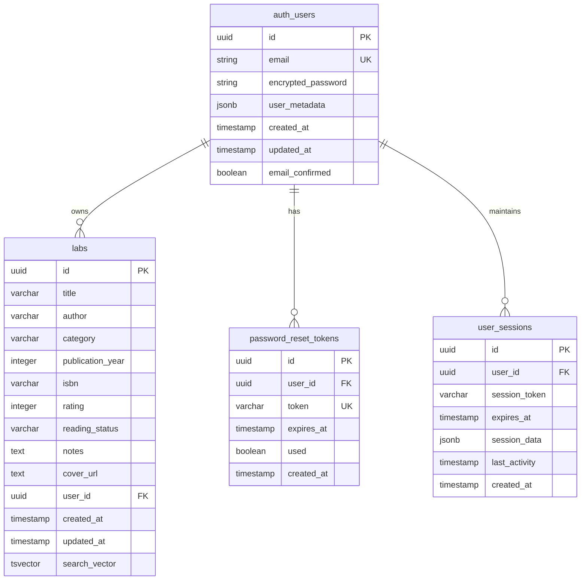

# 📊 Script Labs App - Database Architecture V2.0

## 📋 Document Information

- **Version**: 2.0
- **Date**: July 29, 2025
- **Status**: Database Design Specification
- **Related**: [PRD V2.0](./PRD_Script_Labs_V2.md), [Implementation Architecture](./IMPLEMENTATION_ARCHITECTURE.md)

---

## 🎯 Database Architecture Overview

Script Labs V2 implements a modern PostgreSQL database architecture using Supabase, featuring enhanced search capabilities, security policies, and optimized performance for scalable lab management.

---

## 🏗️ Database Technology Stack

### **Primary Database System**

```
🗄️ Database Stack
├── Database Engine: PostgreSQL 15+
├── Cloud Provider: Supabase
├── Authentication: Supabase Auth
├── Real-time: Supabase Realtime
├── Storage: Supabase Storage (Future)
└── Backup: Automated Supabase Backups
```

### **Database Features**

- **ACID Compliance**: Full transaction support
- **Row Level Security (RLS)**: User data isolation
- **Full-Text Search**: PostgreSQL native search
- **JSON Support**: Flexible metadata storage
- **Auto-scaling**: Supabase managed scaling
- **Point-in-time Recovery**: 30-day backup retention

---

## 📊 Database Schema Design

### **Core Entity Relationship Diagram**



### **Enhanced Table Definitions**

#### **1. Users Table (Supabase Auth)**

```sql
-- Managed by Supabase Auth
-- auth.users table structure (reference)
CREATE TABLE auth.users (
  id UUID DEFAULT gen_random_uuid() PRIMARY KEY,
  email VARCHAR(255) UNIQUE NOT NULL,
  encrypted_password VARCHAR(255),
  email_confirmed_at TIMESTAMP WITH TIME ZONE,
  invited_at TIMESTAMP WITH TIME ZONE,
  confirmation_token VARCHAR(255),
  confirmation_sent_at TIMESTAMP WITH TIME ZONE,
  recovery_token VARCHAR(255),
  recovery_sent_at TIMESTAMP WITH TIME ZONE,
  email_change_token_new VARCHAR(255),
  email_change VARCHAR(255),
  email_change_sent_at TIMESTAMP WITH TIME ZONE,
  last_sign_in_at TIMESTAMP WITH TIME ZONE,
  raw_app_meta_data JSONB,
  raw_user_meta_data JSONB,
  is_super_admin BOOLEAN,
  created_at TIMESTAMP WITH TIME ZONE DEFAULT NOW(),
  updated_at TIMESTAMP WITH TIME ZONE DEFAULT NOW(),
  phone VARCHAR(15),
  phone_confirmed_at TIMESTAMP WITH TIME ZONE,
  phone_change VARCHAR(15),
  phone_change_token VARCHAR(255),
  phone_change_sent_at TIMESTAMP WITH TIME ZONE,
  confirmed_at TIMESTAMP WITH TIME ZONE GENERATED ALWAYS AS (LEAST(email_confirmed_at, phone_confirmed_at)) STORED,
  email_change_token_current VARCHAR(255) DEFAULT '',
  email_change_confirm_status SMALLINT DEFAULT 0,
  banned_until TIMESTAMP WITH TIME ZONE,
  reauthentication_token VARCHAR(255),
  reauthentication_sent_at TIMESTAMP WITH TIME ZONE,
  is_sso_user BOOLEAN DEFAULT FALSE,
  deleted_at TIMESTAMP WITH TIME ZONE
);
```

#### **2. labs Table (Enhanced)**

```sql
CREATE TABLE public.labs (
  -- Primary identifiers
  id UUID DEFAULT gen_random_uuid() PRIMARY KEY,

  -- Basic lab information
  title VARCHAR(500) NOT NULL CHECK (LENGTH(TRIM(title)) > 0),
  author VARCHAR(300) NOT NULL CHECK (LENGTH(TRIM(author)) > 0),

  -- Extended metadata
  category VARCHAR(100),
  publication_year INTEGER CHECK (publication_year >= 1000 AND publication_year <= EXTRACT(YEAR FROM NOW()) + 10),
  isbn VARCHAR(20) CHECK (isbn ~ '^(97[89])?\d{9}(\d|X)$' OR isbn IS NULL),
  rating INTEGER CHECK (rating >= 1 AND rating <= 5),
  reading_status VARCHAR(20) DEFAULT 'to_read' CHECK (reading_status IN ('to_read', 'reading', 'read')),

  -- User content
  notes TEXT CHECK (LENGTH(notes) <= 10000),
  cover_url TEXT CHECK (cover_url ~ '^https?://' OR cover_url IS NULL),

  -- Relationships
  user_id UUID NOT NULL REFERENCES auth.users(id) ON DELETE CASCADE,

  -- Search optimization
  search_vector TSVECTOR GENERATED ALWAYS AS (
    setweight(to_tsvector('english', COALESCE(title, '')), 'A') ||
    setweight(to_tsvector('english', COALESCE(author, '')), 'B') ||
    setweight(to_tsvector('english', COALESCE(category, '')), 'C') ||
    setweight(to_tsvector('english', COALESCE(notes, '')), 'D')
  ) STORED,

  -- Timestamps
  created_at TIMESTAMP WITH TIME ZONE DEFAULT NOW(),
  updated_at TIMESTAMP WITH TIME ZONE DEFAULT NOW()
);

-- Comments for documentation
COMMENT ON TABLE public.labs IS 'User Script Labs with enhanced search and metadata';
COMMENT ON COLUMN public.labs.search_vector IS 'Full-text search vector with weighted fields';
COMMENT ON COLUMN public.labs.rating IS 'User rating from 1-5 stars';
COMMENT ON COLUMN public.labs.reading_status IS 'Current reading status: to_read, reading, read';
```

#### **3. Password Reset Tokens Table**

```sql
CREATE TABLE public.password_reset_tokens (
  -- Primary identifier
  id UUID DEFAULT gen_random_uuid() PRIMARY KEY,

  -- User reference
  user_id UUID NOT NULL REFERENCES auth.users(id) ON DELETE CASCADE,

  -- Token management
  token VARCHAR(255) UNIQUE NOT NULL,
  expires_at TIMESTAMP WITH TIME ZONE NOT NULL,
  used BOOLEAN DEFAULT FALSE,

  -- Security tracking
  ip_address INET,
  user_agent TEXT,

  -- Timestamps
  created_at TIMESTAMP WITH TIME ZONE DEFAULT NOW(),
  used_at TIMESTAMP WITH TIME ZONE
);

-- Comments
COMMENT ON TABLE public.password_reset_tokens IS 'Secure password reset token management';
COMMENT ON COLUMN public.password_reset_tokens.token IS 'Cryptographically secure reset token';
COMMENT ON COLUMN public.password_reset_tokens.expires_at IS 'Token expiration timestamp (max 1 hour)';
```

#### **4. User Sessions Table (Optional - for enhanced session management)**

```sql
CREATE TABLE public.user_sessions (
  -- Primary identifier
  id UUID DEFAULT gen_random_uuid() PRIMARY KEY,

  -- User reference
  user_id UUID NOT NULL REFERENCES auth.users(id) ON DELETE CASCADE,

  -- Session management
  session_token VARCHAR(255) UNIQUE NOT NULL,
  refresh_token VARCHAR(255),
  expires_at TIMESTAMP WITH TIME ZONE NOT NULL,

  -- Session metadata
  session_data JSONB DEFAULT '{}',
  ip_address INET,
  user_agent TEXT,

  -- Activity tracking
  last_activity TIMESTAMP WITH TIME ZONE DEFAULT NOW(),
  created_at TIMESTAMP WITH TIME ZONE DEFAULT NOW()
);

-- Comments
COMMENT ON TABLE public.user_sessions IS 'Enhanced user session tracking and management';
```

---

## 🔍 Database Indexes & Performance

### **Primary Indexes**

```sql
-- labs table indexes
CREATE INDEX idx_labs_user_id ON public.labs(user_id);
CREATE INDEX idx_labs_search_vector ON public.labs USING GIN(search_vector);
CREATE INDEX idx_labs_title_gin ON public.labs USING GIN(to_tsvector('english', title));
CREATE INDEX idx_labs_author_gin ON public.labs USING GIN(to_tsvector('english', author));
CREATE INDEX idx_labs_category ON public.labs(category) WHERE category IS NOT NULL;
CREATE INDEX idx_labs_reading_status ON public.labs(reading_status);
CREATE INDEX idx_labs_rating ON public.labs(rating) WHERE rating IS NOT NULL;
CREATE INDEX idx_labs_publication_year ON public.labs(publication_year) WHERE publication_year IS NOT NULL;
CREATE INDEX idx_labs_created_at_desc ON public.labs(created_at DESC);
CREATE INDEX idx_labs_updated_at_desc ON public.labs(updated_at DESC);

-- Composite indexes for common queries
CREATE INDEX idx_labs_user_category ON public.labs(user_id, category) WHERE category IS NOT NULL;
CREATE INDEX idx_labs_user_status ON public.labs(user_id, reading_status);
CREATE INDEX idx_labs_user_rating ON public.labs(user_id, rating) WHERE rating IS NOT NULL;
CREATE INDEX idx_labs_user_created_desc ON public.labs(user_id, created_at DESC);

-- Password reset tokens indexes
CREATE INDEX idx_password_reset_tokens_token ON public.password_reset_tokens(token);
CREATE INDEX idx_password_reset_tokens_user_id ON public.password_reset_tokens(user_id);
CREATE INDEX idx_password_reset_tokens_expires_at ON public.password_reset_tokens(expires_at);
CREATE INDEX idx_password_reset_tokens_used ON public.password_reset_tokens(used, expires_at);

-- User sessions indexes (if implemented)
CREATE INDEX idx_user_sessions_user_id ON public.user_sessions(user_id);
CREATE INDEX idx_user_sessions_token ON public.user_sessions(session_token);
CREATE INDEX idx_user_sessions_expires_at ON public.user_sessions(expires_at);
CREATE INDEX idx_user_sessions_last_activity ON public.user_sessions(last_activity DESC);
```

### **Index Usage Analysis**

```sql
-- Query to analyze index usage
SELECT
  schemaname,
  tablename,
  indexname,
  idx_tup_read,
  idx_tup_fetch,
  idx_scan
FROM pg_stat_user_indexes
WHERE schemaname = 'public'
ORDER BY idx_scan DESC;

-- Query to find unused indexes
SELECT
  schemaname,
  tablename,
  indexname,
  idx_scan,
  pg_size_pretty(pg_relation_size(indexrelid)) as size
FROM pg_stat_user_indexes
WHERE idx_scan = 0
  AND schemaname = 'public'
ORDER BY pg_relation_size(indexrelid) DESC;
```

---

## 🔐 Row Level Security (RLS)

### **Security Policies**

```sql
-- Enable RLS on all tables
ALTER TABLE public.labs ENABLE ROW LEVEL SECURITY;
ALTER TABLE public.password_reset_tokens ENABLE ROW LEVEL SECURITY;
ALTER TABLE public.user_sessions ENABLE ROW LEVEL SECURITY;

-- labs table policies
CREATE POLICY "users_can_view_own_books" ON public.labs
  FOR SELECT
  USING (auth.uid() = user_id);

CREATE POLICY "users_can_insert_own_books" ON public.labs
  FOR INSERT
  WITH CHECK (auth.uid() = user_id);

CREATE POLICY "users_can_update_own_books" ON public.labs
  FOR UPDATE
  USING (auth.uid() = user_id)
  WITH CHECK (auth.uid() = user_id);

CREATE POLICY "users_can_delete_own_books" ON public.labs
  FOR DELETE
  USING (auth.uid() = user_id);

-- Password reset tokens policies
CREATE POLICY "users_can_view_own_reset_tokens" ON public.password_reset_tokens
  FOR SELECT
  USING (auth.uid() = user_id);

CREATE POLICY "service_can_manage_reset_tokens" ON public.password_reset_tokens
  FOR ALL
  USING (auth.role() = 'service_role');

-- User sessions policies
CREATE POLICY "users_can_view_own_sessions" ON public.user_sessions
  FOR SELECT
  USING (auth.uid() = user_id);

CREATE POLICY "users_can_update_own_sessions" ON public.user_sessions
  FOR UPDATE
  USING (auth.uid() = user_id)
  WITH CHECK (auth.uid() = user_id);

CREATE POLICY "users_can_delete_own_sessions" ON public.user_sessions
  FOR DELETE
  USING (auth.uid() = user_id);
```

### **Security Best Practices**

```sql
-- Grant appropriate permissions
GRANT USAGE ON SCHEMA public TO authenticated;
GRANT ALL ON public.labs TO authenticated;
GRANT ALL ON public.password_reset_tokens TO service_role;
GRANT ALL ON public.user_sessions TO authenticated;

-- Revoke unnecessary permissions
REVOKE ALL ON public.password_reset_tokens FROM authenticated;
REVOKE INSERT, UPDATE, DELETE ON auth.users FROM authenticated;

-- Create security definer functions for sensitive operations
CREATE OR REPLACE FUNCTION public.cleanup_expired_tokens()
RETURNS void
LANGUAGE plpgsql
SECURITY DEFINER
AS $$
BEGIN
  DELETE FROM public.password_reset_tokens
  WHERE expires_at < NOW()
    OR (used = true AND created_at < NOW() - INTERVAL '24 hours');
END;
$$;

-- Grant execute permission to service role only
GRANT EXECUTE ON FUNCTION public.cleanup_expired_tokens() TO service_role;
```

---

## 🔄 Database Functions & Triggers

### **Utility Functions**

```sql
-- Update timestamp trigger function
CREATE OR REPLACE FUNCTION public.update_updated_at_column()
RETURNS TRIGGER
LANGUAGE plpgsql
AS $$
BEGIN
  NEW.updated_at = NOW();
  RETURN NEW;
END;
$$;

-- Search function with ranking
CREATE OR REPLACE FUNCTION public.search_books(
  p_user_id UUID,
  p_search_query TEXT DEFAULT '',
  p_category TEXT DEFAULT NULL,
  p_reading_status TEXT DEFAULT NULL,
  p_limit INTEGER DEFAULT 10,
  p_offset INTEGER DEFAULT 0
)
RETURNS TABLE(
  id UUID,
  title VARCHAR,
  author VARCHAR,
  category VARCHAR,
  reading_status VARCHAR,
  rating INTEGER,
  created_at TIMESTAMP WITH TIME ZONE,
  search_rank REAL
)
LANGUAGE plpgsql
SECURITY DEFINER
AS $$
BEGIN
  RETURN QUERY
  SELECT
    b.id,
    b.title,
    b.author,
    b.category,
    b.reading_status,
    b.rating,
    b.created_at,
    CASE
      WHEN p_search_query = '' THEN 0
      ELSE ts_rank(b.search_vector, plainto_tsquery('english', p_search_query))
    END AS search_rank
  FROM public.labs b
  WHERE
    b.user_id = p_user_id
    AND (p_search_query = '' OR b.search_vector @@ plainto_tsquery('english', p_search_query))
    AND (p_category IS NULL OR b.category = p_category)
    AND (p_reading_status IS NULL OR b.reading_status = p_reading_status)
  ORDER BY
    CASE WHEN p_search_query = '' THEN b.created_at ELSE search_rank END DESC,
    b.created_at DESC
  LIMIT p_limit
  OFFSET p_offset;
END;
$$;

-- lab statistics function
CREATE OR REPLACE FUNCTION public.get_user_book_stats(p_user_id UUID)
RETURNS TABLE(
  total_labs BIGINT,
  labs_read BIGINT,
  labs_reading BIGINT,
  labs_to_read BIGINT,
  average_rating NUMERIC,
  total_authors BIGINT,
  total_categories BIGINT
)
LANGUAGE plpgsql
SECURITY DEFINER
AS $$
BEGIN
  RETURN QUERY
  SELECT
    COUNT(*) as total_labs,
    COUNT(*) FILTER (WHERE reading_status = 'read') as labs_read,
    COUNT(*) FILTER (WHERE reading_status = 'reading') as labs_reading,
    COUNT(*) FILTER (WHERE reading_status = 'to_read') as labs_to_read,
    ROUND(AVG(rating), 2) as average_rating,
    COUNT(DISTINCT author) as total_authors,
    COUNT(DISTINCT category) FILTER (WHERE category IS NOT NULL) as total_categories
  FROM public.labs
  WHERE user_id = p_user_id;
END;
$$;

-- Password reset token validation function
CREATE OR REPLACE FUNCTION public.validate_reset_token(p_token TEXT)
RETURNS TABLE(
  user_id UUID,
  email TEXT,
  expires_at TIMESTAMP WITH TIME ZONE,
  is_valid BOOLEAN
)
LANGUAGE plpgsql
SECURITY DEFINER
AS $$
BEGIN
  RETURN QUERY
  SELECT
    prt.user_id,
    au.email,
    prt.expires_at,
    (prt.expires_at > NOW() AND prt.used = false) as is_valid
  FROM public.password_reset_tokens prt
  JOIN auth.users au ON au.id = prt.user_id
  WHERE prt.token = p_token;
END;
$$;
```

### **Database Triggers**

```sql
-- Auto-update timestamps
CREATE TRIGGER trigger_update_labs_updated_at
  BEFORE UPDATE ON public.labs
  FOR EACH ROW
  EXECUTE FUNCTION public.update_updated_at_column();

-- Auto-cleanup expired tokens (run daily)
CREATE OR REPLACE FUNCTION public.auto_cleanup_expired_tokens()
RETURNS void
LANGUAGE plpgsql
AS $$
BEGIN
  PERFORM public.cleanup_expired_tokens();
END;
$$;

-- Search vector update trigger (if not using GENERATED ALWAYS AS)
CREATE OR REPLACE FUNCTION public.update_book_search_vector()
RETURNS TRIGGER
LANGUAGE plpgsql
AS $$
BEGIN
  NEW.search_vector :=
    setweight(to_tsvector('english', COALESCE(NEW.title, '')), 'A') ||
    setweight(to_tsvector('english', COALESCE(NEW.author, '')), 'B') ||
    setweight(to_tsvector('english', COALESCE(NEW.category, '')), 'C') ||
    setweight(to_tsvector('english', COALESCE(NEW.notes, '')), 'D');
  RETURN NEW;
END;
$$;

-- Only needed if not using GENERATED ALWAYS AS
-- CREATE TRIGGER trigger_update_book_search_vector
--   BEFORE INSERT OR UPDATE ON public.labs
--   FOR EACH ROW
--   EXECUTE FUNCTION public.update_book_search_vector();
```

---

## 📈 Performance Optimization

### **Query Optimization Examples**

```sql
-- Optimized search query with explain plan
EXPLAIN (ANALYZE, BUFFERS)
SELECT * FROM public.search_books(
  'user-uuid-here'::uuid,
  'javascript programming',
  'Technical',
  NULL,
  10,
  0
);

-- Performance monitoring query
SELECT
  query,
  calls,
  total_time,
  mean_time,
  rows
FROM pg_stat_statements
WHERE query LIKE '%labs%'
ORDER BY total_time DESC
LIMIT 10;

-- Index usage statistics
SELECT
  t.tablename,
  indexname,
  c.reltuples as num_rows,
  pg_size_pretty(pg_relation_size(quote_ident(t.tablename)::text)) as table_size,
  pg_size_pretty(pg_relation_size(indexrelid)) as index_size,
  CASE WHEN indisunique THEN 'Y' ELSE 'N' END as unique,
  idx_scan as number_of_scans,
  idx_tup_read as tuples_read,
  idx_tup_fetch as tuples_fetched
FROM pg_tables t
LEFT OUTER JOIN pg_class c ON c.relname = t.tablename
LEFT OUTER JOIN pg_index i ON c.oid = i.indrelid
LEFT OUTER JOIN pg_class c2 ON c2.oid = i.indexrelid
LEFT OUTER JOIN pg_stat_user_indexes psai ON i.indexrelid = psai.indexrelid
WHERE t.schemaname = 'public'
ORDER BY pg_relation_size(indexrelid) DESC;
```

### **Performance Tuning Configuration**

```sql
-- Optimize PostgreSQL for Script Labs workload
-- These would be set in postgresql.conf or via Supabase dashboard

-- Memory settings
-- shared_buffers = 256MB
-- effective_cache_size = 1GB
-- work_mem = 4MB
-- maintenance_work_mem = 64MB

-- Query planner settings
-- random_page_cost = 1.1
-- effective_io_concurrency = 200

-- Full-text search settings
-- default_text_search_config = 'english'

-- Analyze tables for better query planning
ANALYZE public.labs;
ANALYZE public.password_reset_tokens;
ANALYZE public.user_sessions;

-- Update table statistics
SELECT pg_stat_reset();
```

---

## 💾 Backup & Recovery Strategy

### **Backup Configuration**

```sql
-- Point-in-time recovery information
SELECT
  pg_is_in_recovery() as in_recovery,
  pg_last_wal_receive_lsn() as last_wal_receive,
  pg_last_wal_replay_lsn() as last_wal_replay,
  pg_last_xact_replay_timestamp() as last_replay_time;

-- Database size monitoring
SELECT
  pg_database.datname,
  pg_size_pretty(pg_database_size(pg_database.datname)) AS size
FROM pg_database
WHERE datname = current_database();

-- Table size monitoring
SELECT
  schemaname,
  tablename,
  pg_size_pretty(pg_total_relation_size(schemaname||'.'||tablename)) as size,
  pg_size_pretty(pg_relation_size(schemaname||'.'||tablename)) as table_size,
  pg_size_pretty(pg_total_relation_size(schemaname||'.'||tablename) - pg_relation_size(schemaname||'.'||tablename)) as index_size
FROM pg_tables
WHERE schemaname = 'public'
ORDER BY pg_total_relation_size(schemaname||'.'||tablename) DESC;
```

### **Data Export/Import Scripts**

```sql
-- Export labs data
COPY (
  SELECT
    b.id,
    b.title,
    b.author,
    b.category,
    b.publication_year,
    b.isbn,
    b.rating,
    b.reading_status,
    b.notes,
    b.cover_url,
    au.email as user_email,
    b.created_at,
    b.updated_at
  FROM public.labs b
  JOIN auth.users au ON au.id = b.user_id
) TO '/tmp/books_backup.csv' WITH CSV HEADER;

-- Export user statistics
COPY (
  SELECT
    au.email,
    au.created_at as user_created_at,
    stats.*
  FROM auth.users au
  CROSS JOIN LATERAL public.get_user_book_stats(au.id) stats
) TO '/tmp/user_stats_backup.csv' WITH CSV HEADER;
```

---

## 🔧 Database Maintenance

### **Regular Maintenance Tasks**

```sql
-- Vacuum and analyze (automated by Supabase)
VACUUM ANALYZE public.labs;
VACUUM ANALYZE public.password_reset_tokens;

-- Reindex if needed
REINDEX INDEX CONCURRENTLY idx_labs_search_vector;

-- Update table statistics
SELECT pg_stat_reset_single_table_counters('public.labs'::regclass);

-- Check for table bloat
SELECT
  schemaname,
  tablename,
  pg_size_pretty(pg_total_relation_size(schemaname||'.'||tablename)) as size,
  n_dead_tup,
  n_live_tup,
  ROUND(n_dead_tup * 100.0 / GREATEST(n_live_tup + n_dead_tup, 1), 2) as dead_percentage
FROM pg_stat_user_tables
WHERE schemaname = 'public'
ORDER BY n_dead_tup DESC;
```

### **Health Monitoring Queries**

```sql
-- Connection monitoring
SELECT
  count(*) as total_connections,
  count(*) FILTER (WHERE state = 'active') as active_connections,
  count(*) FILTER (WHERE state = 'idle') as idle_connections
FROM pg_stat_activity;

-- Long running queries
SELECT
  pid,
  now() - pg_stat_activity.query_start AS duration,
  query
FROM pg_stat_activity
WHERE (now() - pg_stat_activity.query_start) > interval '5 minutes'
  AND state != 'idle';

-- Lock monitoring
SELECT
  t.relname,
  l.locktype,
  page,
  virtualtransaction,
  pid,
  mode,
  granted
FROM pg_locks l,
     pg_stat_all_tables t
WHERE l.relation = t.relid
  AND t.schemaname = 'public'
ORDER BY relation ASC;
```

---

## 📊 Database Metrics & KPIs

### **Performance Metrics**

| Metric                      | Target  | Monitoring Query                                                                                   |
| --------------------------- | ------- | -------------------------------------------------------------------------------------------------- |
| Average Query Response Time | < 100ms | `SELECT mean_time FROM pg_stat_statements WHERE query LIKE '%labs%'`                               |
| Search Query Performance    | < 200ms | `EXPLAIN ANALYZE SELECT * FROM search_books(...)`                                                  |
| Index Hit Ratio             | > 95%   | `SELECT sum(idx_blks_hit) * 100 / sum(idx_blks_hit + idx_blks_read) FROM pg_statio_user_indexes`   |
| Table Hit Ratio             | > 95%   | `SELECT sum(heap_blks_hit) * 100 / sum(heap_blks_hit + heap_blks_read) FROM pg_statio_user_tables` |
| Connection Usage            | < 80%   | `SELECT count(*) * 100.0 / current_setting('max_connections')::int FROM pg_stat_activity`          |

### **Business Metrics**

```sql
-- Daily active users
SELECT
  DATE(last_sign_in_at) as date,
  COUNT(DISTINCT id) as daily_active_users
FROM auth.users
WHERE last_sign_in_at >= NOW() - INTERVAL '30 days'
GROUP BY DATE(last_sign_in_at)
ORDER BY date DESC;

-- lab creation trends
SELECT
  DATE(created_at) as date,
  COUNT(*) as books_created,
  COUNT(DISTINCT user_id) as active_users
FROM public.labs
WHERE created_at >= NOW() - INTERVAL '30 days'
GROUP BY DATE(created_at)
ORDER BY date DESC;

-- Search usage analytics
-- (Would need to log search queries)
-- This is conceptual - actual implementation would require search logging
```

---

## 🎯 Database Architecture Summary

### **Key Features Implemented**

- ✅ **Scalable Schema**: Supabase PostgreSQL with modern design
- ✅ **Full-Text Search**: Optimized search with ranking and weighting
- ✅ **Security**: Row Level Security with comprehensive policies
- ✅ **Performance**: Strategic indexing and query optimization
- ✅ **Maintainability**: Functions, triggers, and automated cleanup
- ✅ **Monitoring**: Health checks and performance metrics

### **Performance Characteristics**

- **Search Queries**: Target < 200ms response time
- **CRUD Operations**: Target < 100ms response time
- **Concurrent Users**: Designed for 1000+ simultaneous users
- **Data Volume**: Optimized for millions of labs per user
- **Backup/Recovery**: 30-day point-in-time recovery

### **Security Features**

- **Data Isolation**: RLS ensures users only see their own data
- **Token Security**: Secure password reset with expiration
- **Audit Trail**: Comprehensive logging and monitoring
- **Access Control**: Granular permissions and role-based access

**This database architecture provides a robust, scalable foundation for Script Labs V2!** 📚

---

**Document Status**: ✅ Complete  
**Last Updated**: July 29, 2025  
**Next Review**: During implementation milestones
