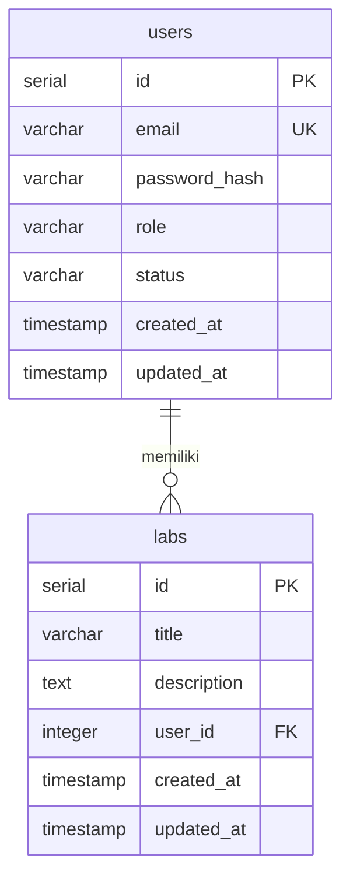

# 📊 Script Labs App - Arsitektur Database V2.0

## 📋 Informasi Dokumen

- **Versi**: 2.0 (ditulis ulang agar sesuai dengan `database/schema_pg.sql` dan query aktual di `backend/routes/*.js`)
- **Tanggal**: 13 September 2026
- **Status**: Aktif / Acuan Utama
- **Terkait**: [PRD V2.0](./PRD_Script_Labs_V2.md), [Dokumentasi API](./API_DOCUMENTATION_V2.md)

---

## 🎯 Gambaran Umum

Script Labs memakai database **PostgreSQL self-hosted** yang kecil, dengan dua tabel. Tidak ada layanan database terkelola (bukan Supabase, tidak ada RLS, tidak ada full-text search, tidak ada Redis) — semuanya berjalan di server yang sama dengan API lewat driver `pg` (node-postgres).

```
🗄️ Database Stack
├── Engine: PostgreSQL (self-hosted, mis. di Vultr VPS yang sama dengan API)
├── Client: pg (node-postgres) — backend/db.js
├── Koneksi: satu Pool, dikonfigurasi lewat DATABASE_URL
└── Migrasi: file SQL biasa, database/schema_pg.sql (tanpa migration framework)
```

---

## 📊 Skema

### Entity Relationship


```mermaid
erDiagram
    users ||--o{ labs : "memiliki"

    users {
        serial id PK
        varchar email UK
        varchar password_hash
        varchar role
        varchar status
        timestamp created_at
        timestamp updated_at
    }

    labs {
        serial id PK
        varchar title
        text description
        integer user_id FK
        timestamp created_at
        timestamp updated_at
    }
```

### Tabel: `users`

```sql
CREATE TABLE users (
  id SERIAL PRIMARY KEY,
  email VARCHAR(255) UNIQUE NOT NULL,
  password_hash VARCHAR(255) NOT NULL,
  role VARCHAR(50) NOT NULL DEFAULT 'user',
  status VARCHAR(50) NOT NULL DEFAULT 'active',
  created_at TIMESTAMP DEFAULT NOW(),
  updated_at TIMESTAMP DEFAULT NOW()
);
```

| Kolom | Catatan |
|-------|---------|
| `id` | Bilangan bulat auto-increment biasa, **bukan** UUID. Inilah yang ditanam sebagai `userId` di dalam JWT. |
| `email` | Unik, dicocokkan tidak case-sensitive oleh aplikasi (di-lowercase sebelum setiap query). |
| `password_hash` | Hash bcrypt, cost factor 12. Tidak pernah dikembalikan oleh endpoint mana pun. |
| `role` | Selalu `"user"` saat ini — belum ada role-based access control yang diimplementasikan, kolom ini dicadangkan untuk masa depan. |
| `status` | `"active"` atau `"locked"`. Status `"locked"` membuat login mengembalikan 403. |

### Tabel: `labs`

```sql
CREATE TABLE labs (
  id SERIAL PRIMARY KEY,
  title VARCHAR(255) NOT NULL,
  description TEXT,
  user_id INTEGER,
  created_at TIMESTAMP DEFAULT NOW(),
  updated_at TIMESTAMP DEFAULT NOW(),
  CONSTRAINT fk_user FOREIGN KEY (user_id) REFERENCES users(id) ON DELETE SET NULL
);
```

| Kolom | Catatan |
|-------|---------|
| `id` | Bilangan bulat auto-increment biasa. |
| `title` | 1-255 karakter (divalidasi di level aplikasi, bukan constraint database). |
| `description` | 1-1000 karakter (divalidasi di level aplikasi). |
| `user_id` | Pemilik lab. Jika user pemiliknya dihapus, `user_id` di-set `NULL`, bukan ikut menghapus lab-nya (tidak ada cascade delete). |

> Tidak ada tabel/kolom `password_reset_tokens`, `user_sessions`, `search_vector`, `category`, `rating`, `isbn`, atau `reading_status` di mana pun dalam skema ini. Draf dokumen sebelumnya pernah menyebutkan itu semua; tidak pernah benar-benar dibangun.

---

## 🔍 Pola Query yang Benar-Benar Dipakai

Semua query lab di-scope dengan `user_id` yang diambil dari JWT (tidak pernah dipercaya dari body request), sehingga akses lintas-user dicegah di level query:

```sql
-- list / search
SELECT * FROM labs WHERE user_id = $1 ORDER BY created_at DESC LIMIT $2 OFFSET $3;
SELECT * FROM labs WHERE user_id = $1 AND (title ILIKE $2 OR description ILIKE $2) ORDER BY created_at DESC LIMIT $3 OFFSET $4;

-- ambil satu / update / delete (semua di-scope dengan user_id di klausa WHERE)
SELECT * FROM labs WHERE id = $1 AND user_id = $2;
UPDATE labs SET title = $1, updated_at = NOW() WHERE id = $2 AND user_id = $3 RETURNING *;
DELETE FROM labs WHERE id = $1 AND user_id = $2 RETURNING *;
```

Semua query bersifat parameterized (`$1`, `$2`, ...) — tidak ada SQL hasil concatenation string di seluruh codebase, sehingga SQL injection lewat input-input ini bukan celah serangan yang bisa dieksploitasi pada kode saat ini.

Belum ada index eksplisit selain primary key dan unique constraint pada `email`. **Tidak ada index full-text search** — pencarian memakai `ILIKE '%kata%'` yang melakukan sequential scan; ini target performance-testing yang sah dan mudah bagi QA (latensi pencarian seharusnya bertambah seiring bertambahnya jumlah baris tanpa index).

---

## 🔌 Penanganan Koneksi

```javascript
// backend/db.js
const pool = new Pool({
  connectionString: process.env.DATABASE_URL,
  ssl: { rejectUnauthorized: false },
});
```

- Satu `Pool` koneksi dibuat saat proses dimulai dengan ukuran **default** (`max: 10` koneksi — tidak dikonfigurasi secara eksplisit). Di bawah beban bersamaan (mis. saat performance testing), ukuran pool ini adalah batas konkurensi yang realistis untuk diamati: request yang melebihi 10 operasi DB bersamaan akan mengantre.
- Tidak ada read replica, tidak ada caching layer, dan tidak ada logic retry/backoff koneksi — gangguan database akan muncul sebagai error 500 di level request.

---

## 💾 Setup Database Lokal

Lihat [README.md](../README.md#local-development) untuk panduan lengkap langkah demi langkah, atau versi singkatnya:

```bash
psql -U postgres -c "CREATE DATABASE scriptlabs_db;"
psql "postgresql://<user>:<pass>@localhost:5432/scriptlabs_db" -f database/schema_pg.sql
```

Jangan membuat user seed manual dengan password plaintext atau hash sembarangan — selalu buat akun test lewat `POST /api/auth/register` supaya `password_hash` dihasilkan oleh pemanggilan bcrypt yang sama seperti yang diharapkan alur login.

---

**Status Dokumen**: ✅ Lengkap
**Terakhir Diperbarui**: 13 September 2026
