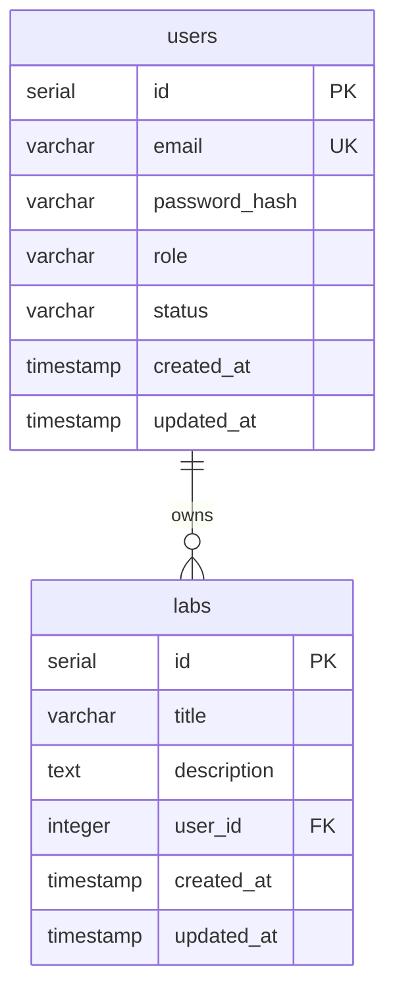

# 📊 Script Labs App - Database Architecture V2.0

## 📋 Document Information

- **Version**: 2.0 (rewritten to match `database/schema_pg.sql` and actual queries in `backend/routes/*.js`)
- **Date**: 13 September 2026
- **Status**: Current / Authoritative
- **Related**: [PRD V2.0](./PRD_Script_Labs_V2.md), [API Documentation](./API_DOCUMENTATION_V2.md)

---

## 🎯 Overview

Script Labs uses a small, self-hosted **PostgreSQL** database with two tables. There is no managed database service (no Supabase, no RLS, no full-text search, no Redis) — everything runs on the same server as the API via the `pg` (node-postgres) driver.

```
🗄️ Database Stack
├── Engine: PostgreSQL (self-hosted, e.g. on the same Vultr VPS as the API)
├── Client: pg (node-postgres) — backend/db.js
├── Connection: single Pool, configured via DATABASE_URL
└── Migrations: plain SQL file, database/schema_pg.sql (no migration framework)
```

---

## 📊 Schema

### Entity Relationship


```mermaid
erDiagram
    users ||--o{ labs : "owns"

    users {
        serial id PK
        varchar email UK
        varchar password_hash
        varchar role
        varchar status
        timestamp created_at
        timestamp updated_at
    }

    labs {
        serial id PK
        varchar title
        text description
        integer user_id FK
        timestamp created_at
        timestamp updated_at
    }
```

### Table: `users`

```sql
CREATE TABLE users (
  id SERIAL PRIMARY KEY,
  email VARCHAR(255) UNIQUE NOT NULL,
  password_hash VARCHAR(255) NOT NULL,
  role VARCHAR(50) NOT NULL DEFAULT 'user',
  status VARCHAR(50) NOT NULL DEFAULT 'active',
  created_at TIMESTAMP DEFAULT NOW(),
  updated_at TIMESTAMP DEFAULT NOW()
);
```

| Column | Notes |
|--------|-------|
| `id` | Plain auto-incrementing integer, **not** a UUID. This is what's embedded in the JWT as `userId`. |
| `email` | Unique, matched case-insensitively by the application (lowercased before every query). |
| `password_hash` | bcrypt hash, cost factor 12. Never returned by any endpoint. |
| `role` | Always `"user"` today — there is no role-based access control implemented, this column is reserved. |
| `status` | `"active"` or `"locked"`. A `"locked"` status makes login return 403. |

### Table: `labs`

```sql
CREATE TABLE labs (
  id SERIAL PRIMARY KEY,
  title VARCHAR(255) NOT NULL,
  description TEXT,
  user_id INTEGER,
  created_at TIMESTAMP DEFAULT NOW(),
  updated_at TIMESTAMP DEFAULT NOW(),
  CONSTRAINT fk_user FOREIGN KEY (user_id) REFERENCES users(id) ON DELETE SET NULL
);
```

| Column | Notes |
|--------|-------|
| `id` | Plain auto-incrementing integer. |
| `title` | 1-255 characters (enforced by application validation, not a DB constraint). |
| `description` | 1-1000 characters (enforced by application validation). |
| `user_id` | Owner of the lab. If the owning user is deleted, `user_id` is set to `NULL` rather than cascading a delete of the lab. |

> There is **no** `password_reset_tokens`, `user_sessions`, `search_vector`, `category`, `rating`, `isbn`, or `reading_status` column/table anywhere in this schema. Earlier draft docs described those; they were never built.

---

## 🔍 Query Patterns Actually Used

All labs queries are scoped by `user_id` taken from the JWT (never trusted from the request body), so cross-user access is prevented at the query level:

```sql
-- list / search
SELECT * FROM labs WHERE user_id = $1 ORDER BY created_at DESC LIMIT $2 OFFSET $3;
SELECT * FROM labs WHERE user_id = $1 AND (title ILIKE $2 OR description ILIKE $2) ORDER BY created_at DESC LIMIT $3 OFFSET $4;

-- get one / update / delete (all scoped by user_id in the WHERE clause)
SELECT * FROM labs WHERE id = $1 AND user_id = $2;
UPDATE labs SET title = $1, updated_at = NOW() WHERE id = $2 AND user_id = $3 RETURNING *;
DELETE FROM labs WHERE id = $1 AND user_id = $2 RETURNING *;
```

All queries are parameterized (`$1`, `$2`, ...) — there is no string-concatenated SQL anywhere in the codebase, so SQL injection via these inputs is not a viable attack surface as currently written.

No explicit indexes beyond the primary keys and the `email` unique constraint exist today. There is **no full-text search index** — search uses `ILIKE '%term%'`, which does a sequential scan; this is a legitimate, easy performance-test target for QA (search latency should grow with row count in the absence of an index).

---

## 🔌 Connection Handling

```javascript
// backend/db.js
const pool = new Pool({
  connectionString: process.env.DATABASE_URL,
  ssl: { rejectUnauthorized: false },
});
```

- A single connection `Pool` is created at process start with the **default** pool size (`max: 10` connections — not explicitly configured). Under concurrent load (e.g. performance testing), this pool size is a realistic bottleneck to observe: requests beyond 10 concurrent DB-bound operations will queue.
- There is no read replica, no caching layer, and no connection retry/backoff logic — a database outage surfaces as request-level 500 errors.

---

## 💾 Setting Up a Local Database

See [README.md](../README.md#local-development) for the full step-by-step, or the short version:

```bash
psql -U postgres -c "CREATE DATABASE scriptlabs_db;"
psql "postgresql://<user>:<pass>@localhost:5432/scriptlabs_db" -f database/schema_pg.sql
```

Do **not** insert seed users manually with plaintext or arbitrary hashes — always create test accounts via `POST /api/auth/register` so `password_hash` is produced by the same bcrypt call the login flow expects.

---

**Document Status**: ✅ Complete
**Last Updated**: 13 September 2026
