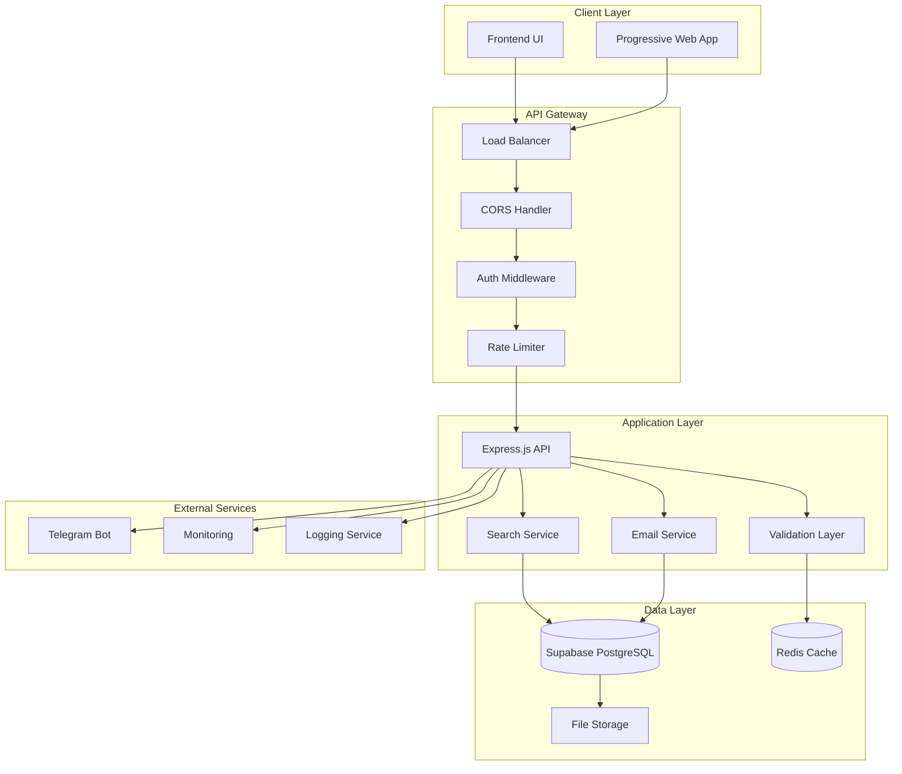
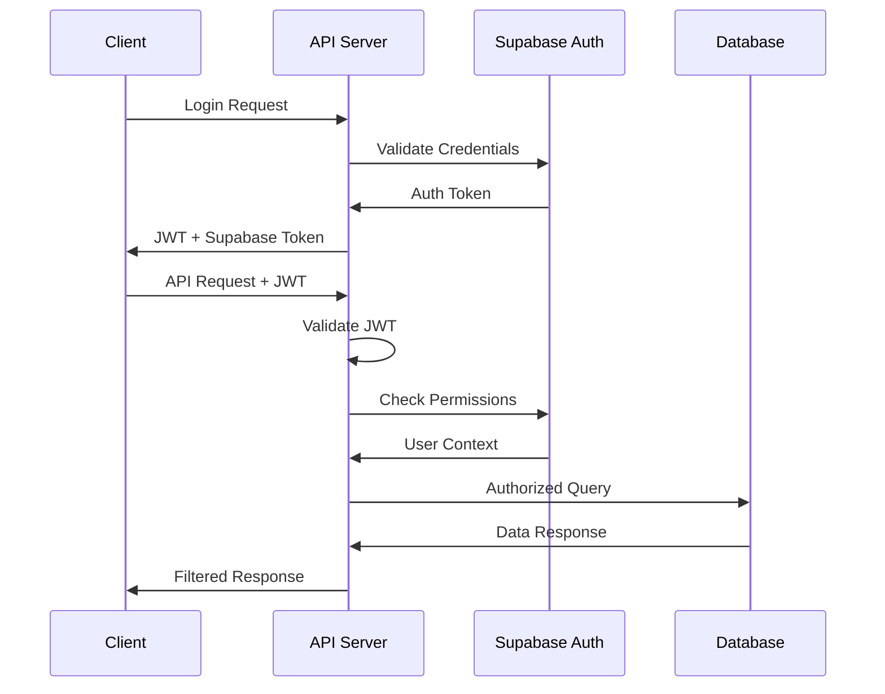
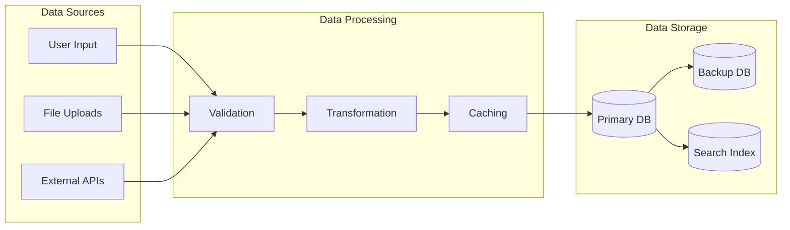
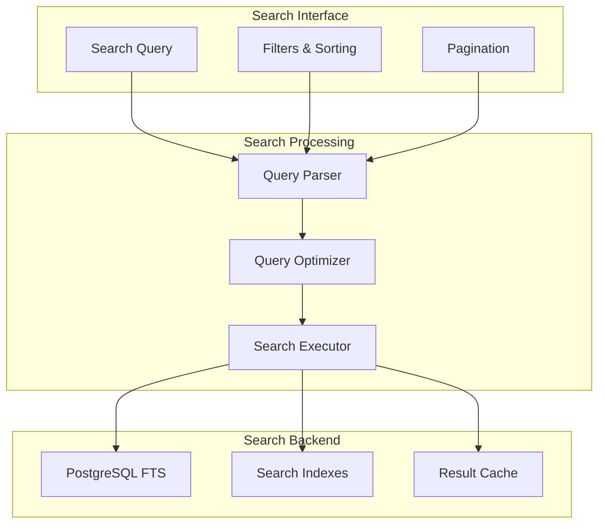
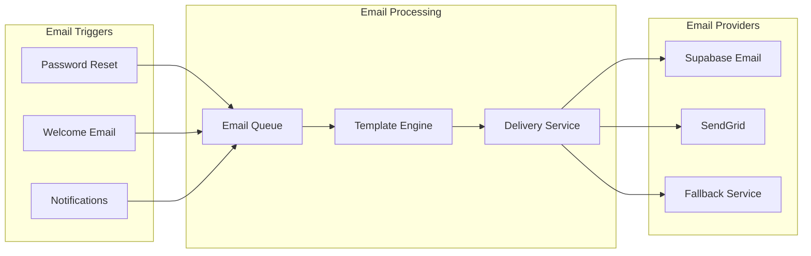
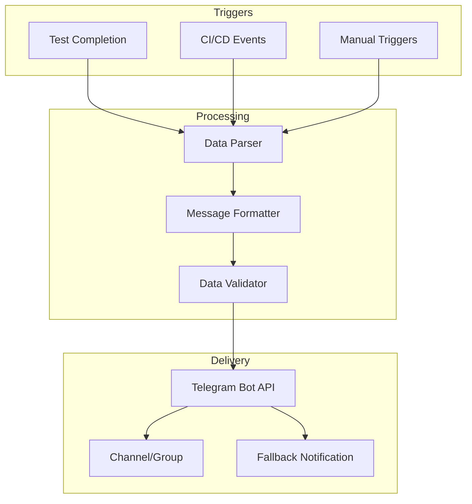
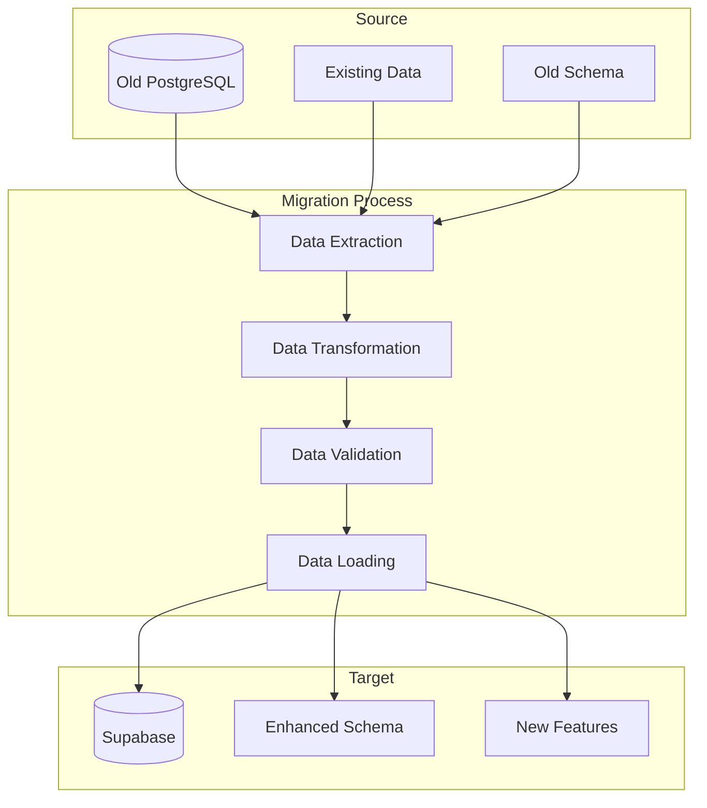
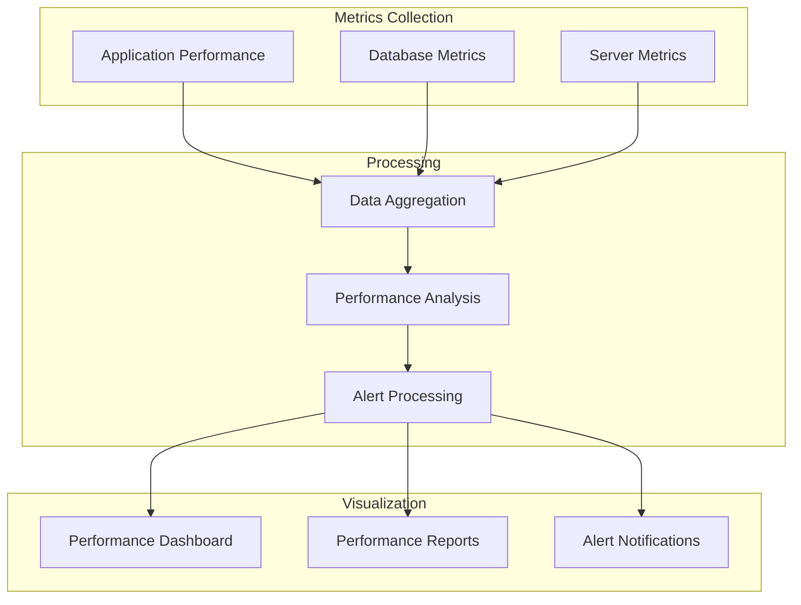
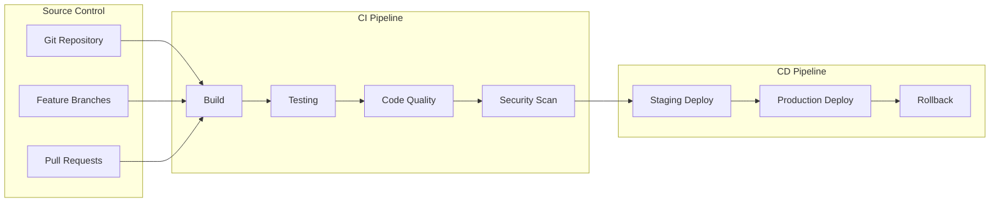

# 🏗️ Script Labs App - System Architecture V2.0

## 📋 Document Information

- **Version**: 2.0
- **Date**: July 29, 2025
- **Status**: Enhanced Architecture
- **Related**: [PRD V2.0](./PRD_Script_Labs_V2.md)

---

## 🎯 Architecture Overview

Script Labs App V2 implements a modern, scalable architecture with Supabase integration, enhanced search capabilities, and comprehensive security features.

### 🔄 High-Level Architecture



---

## 🏛️ Layered Architecture

### 1. **Presentation Layer**

```
📱 Frontend (Client)
├── HTML5/CSS3/JavaScript
├── Responsive Design
├── Progressive Web App Features
└── Real-time Updates (Future)
```

### 2. **API Gateway Layer**

```
🚪 Gateway Services
├── Load Balancing
├── CORS Configuration
├── Authentication Middleware
├── Rate Limiting
├── Request Validation
└── Security Headers
```

### 3. **Business Logic Layer**

```
⚙️ Application Services
├── lab Management Service
├── Search & Filter Service
├── Authentication Service
├── Password Reset Service
├── Email Service
├── Telegram Notification Service
└── Validation Service
```

### 4. **Data Access Layer**

```
📊 Data Services
├── Supabase Client
├── Query Optimization
├── Connection Pooling
├── Cache Management
├── Transaction Handling
└── Migration Scripts
```

### 5. **Infrastructure Layer**

```
🔧 Infrastructure
├── Supabase Database
├── Redis Cache
├── File Storage
├── CI/CD Pipeline
├── Monitoring & Logging
└── Backup Systems
```

---

## 🔐 Security Architecture

### Authentication & Authorization Flow



### Security Layers

```
🛡️ Security Stack
├── Frontend Security
│   ├── Input Sanitization
│   ├── XSS Protection
│   └── CSRF Tokens
├── API Security
│   ├── JWT Validation
│   ├── Rate Limiting
│   ├── Request Validation
│   └── HTTPS Enforcement
├── Database Security
│   ├── Row Level Security (RLS)
│   ├── SQL Injection Prevention
│   ├── Encrypted Connections
│   └── Audit Logging
└── Infrastructure Security
    ├── Environment Variables
    ├── Secret Management
    ├── Network Security
    └── Access Controls
```

---

## 📊 Data Architecture

### Database Schema Design

```sql
-- Core Entities Relationship
Users (Supabase Auth) 1---* labs
Users (Supabase Auth) 1---* PasswordResetTokens
Users (Supabase Auth) 1---* UserSessions
```

### Data Flow Architecture



### Caching Strategy

```
📋 Cache Layers
├── Browser Cache (Static Assets)
├── CDN Cache (Global Distribution)
├── Application Cache (API Responses)
├── Database Cache (Query Results)
└── Session Cache (User Data)
```

---

## 🔍 Search Architecture

### Search System Design



### Search Performance Optimization

```
🚀 Search Optimizations
├── Database Indexes
│   ├── Title B-tree Index
│   ├── Author B-tree Index
│   ├── Full-text Search Index
│   └── Composite Indexes
├── Query Optimization
│   ├── Query Planning
│   ├── Result Caching
│   ├── Pagination Optimization
│   └── Filter Preprocessing
└── Performance Monitoring
    ├── Query Execution Time
    ├── Index Usage Statistics
    ├── Cache Hit Ratios
    └── Resource Utilization
```

---

## 📧 Email Architecture

### Email Service Integration



### Email Security & Compliance

```
📧 Email Security
├── Authentication
│   ├── SPF Records
│   ├── DKIM Signing
│   └── DMARC Policy
├── Content Security
│   ├── Template Validation
│   ├── Link Security
│   └── Attachment Scanning
└── Delivery Monitoring
    ├── Bounce Handling
    ├── Complaint Processing
    ├── Delivery Tracking
    └── Analytics
```

---

## 🤖 Telegram Integration Architecture

### Bot Architecture



---

## 🔄 Migration Architecture

### Database Migration Strategy



### Migration Phases

```
🔄 Migration Strategy
├── Phase 1: Infrastructure Setup
│   ├── Supabase Project Creation
│   ├── Authentication Configuration
│   ├── Database Schema Setup
│   └── Security Policies
├── Phase 2: Parallel Development
│   ├── API Endpoint Updates
│   ├── Database Client Changes
│   ├── Feature Flag Implementation
│   └── Testing Environment
├── Phase 3: Data Migration
│   ├── Data Export Scripts
│   ├── Data Transformation
│   ├── Data Validation
│   └── Data Import
└── Phase 4: Cutover
    ├── DNS Updates
    ├── Database Switching
    ├── Monitoring & Alerts
    └── Rollback Procedures
```

---

## 📈 Performance Architecture

### Performance Monitoring



### Performance Targets

```
🎯 Performance Benchmarks
├── API Response Times
│   ├── lab CRUD: < 200ms
│   ├── Search Queries: < 300ms
│   ├── Authentication: < 100ms
│   └── File Uploads: < 2s
├── Database Performance
│   ├── Query Execution: < 50ms
│   ├── Connection Pool: 95% efficiency
│   ├── Index Usage: > 90%
│   └── Cache Hit Rate: > 80%
└── System Resources
    ├── CPU Usage: < 70%
    ├── Memory Usage: < 80%
    ├── Disk I/O: < 60%
    └── Network Latency: < 50ms
```

---

## 🛠️ Deployment Architecture

### CI/CD Pipeline



### Environment Architecture

```
🌍 Environment Strategy
├── Development
│   ├── Local Database
│   ├── Mock Services
│   ├── Development Secrets
│   └── Debug Logging
├── Staging
│   ├── Supabase Staging
│   ├── Production-like Data
│   ├── Performance Testing
│   └── Integration Testing
└── Production
    ├── Supabase Production
    ├── High Availability
    ├── Monitoring & Alerts
    └── Backup & Recovery
```

---

## 📋 Technology Stack

### Frontend Stack

```
🎨 Frontend Technologies
├── Core Technologies
│   ├── HTML5 (Semantic markup)
│   ├── CSS3 (Modern styling)
│   └── Vanilla JavaScript (ES6+)
├── Build Tools
│   ├── Webpack (Future consideration)
│   ├── Babel (Future consideration)
│   └── PostCSS (Future consideration)
└── Testing
    ├── Jest (Unit testing)
    ├── Cypress (E2E testing)
    └── Testing Library (Component testing)
```

### Backend Stack

```
⚙️ Backend Technologies
├── Runtime & Framework
│   ├── Node.js (v18+)
│   ├── Express.js (Web framework)
│   └── Middleware Stack
├── Database & Storage
│   ├── Supabase PostgreSQL
│   ├── Redis (Caching)
│   └── File Storage (Future)
├── Authentication
│   ├── Supabase Auth
│   ├── JWT Tokens
│   └── bcryptjs (Password hashing)
└── Communication
    ├── REST APIs
    ├── Telegram Bot API
    └── Email Services
```

### DevOps Stack

```
🔧 DevOps Technologies
├── Version Control
│   ├── Git
│   └── GitHub
├── CI/CD
│   ├── GitHub Actions
│   ├── Docker (Future)
│   └── Container Registry
├── Monitoring
│   ├── Application Monitoring
│   ├── Database Monitoring
│   └── Infrastructure Monitoring
└── Security
    ├── SonarCloud (Code Quality)
    ├── Snyk (Security Scanning)
    └── Environment Secrets
```

---

## 🔮 Future Architecture Considerations

### Scalability Enhancements

```
📈 Future Scalability
├── Microservices Architecture
│   ├── lab Service
│   ├── User Service
│   ├── Search Service
│   └── Notification Service
├── Containerization
│   ├── Docker Containers
│   ├── Kubernetes Orchestration
│   └── Service Mesh
└── Performance Optimization
    ├── CDN Integration
    ├── Edge Computing
    └── Advanced Caching
```

### Advanced Features

```
🚀 Future Features
├── Real-time Capabilities
│   ├── WebSocket Integration
│   ├── Live Updates
│   └── Collaborative Features
├── AI/ML Integration
│   ├── lab Recommendations
│   ├── Search Enhancement
│   └── Content Analysis
└── Mobile Applications
    ├── React Native
    ├── Progressive Web App
    └── Offline Capabilities
```

---

## 📊 Architecture Metrics

### Quality Attributes

| Attribute           | Current | Target    | Measurement             |
| ------------------- | ------- | --------- | ----------------------- |
| **Availability**    | 99.0%   | 99.9%     | Uptime monitoring       |
| **Performance**     | Good    | Excellent | Response time < 300ms   |
| **Scalability**     | Limited | High      | Concurrent users: 1000+ |
| **Security**        | Good    | Excellent | Security audit score    |
| **Maintainability** | Good    | Excellent | Code complexity metrics |
| **Reliability**     | Good    | Excellent | Error rate < 0.1%       |

### Architecture Decision Records (ADRs)

1. **ADR-001**: Choose Supabase over self-hosted PostgreSQL
2. **ADR-002**: Implement hybrid authentication (Supabase + JWT)
3. **ADR-003**: Use PostgreSQL full-text search over Elasticsearch
4. **ADR-004**: Implement Telegram notifications for CI/CD
5. **ADR-005**: Choose REST API over GraphQL for simplicity

---

## 🎯 Conclusion

The Script Labs App V2 architecture provides a solid foundation for:

- **Scalable Growth**: Supabase backend with modern stack
- **Enhanced Features**: Search, password reset, notifications
- **Security First**: Comprehensive security layers
- **Performance**: Optimized for speed and efficiency
- **Maintainability**: Clean architecture and separation of concerns

This architecture supports current requirements while providing flexibility for future enhancements and scaling needs.

---

**Document Status**: ✅ Complete  
**Last Updated**: July 29, 2025  
**Next Review**: During implementation milestones
