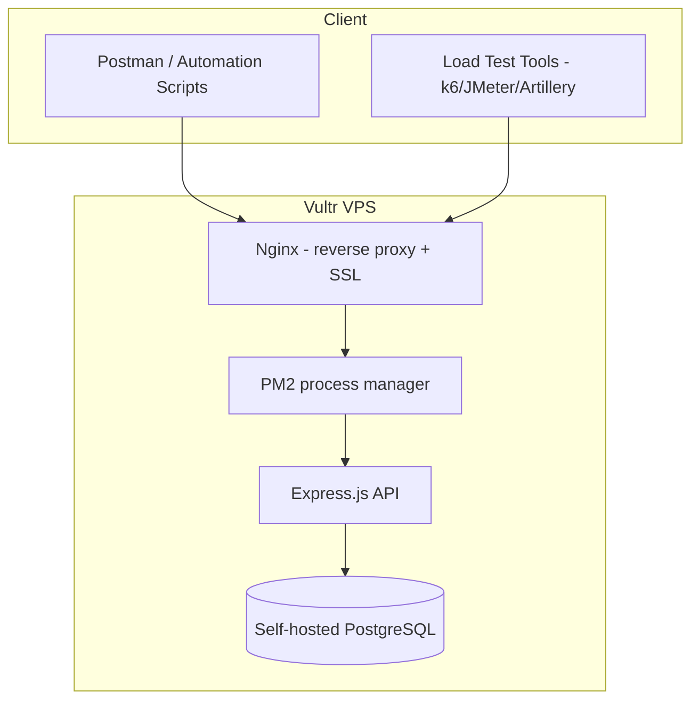
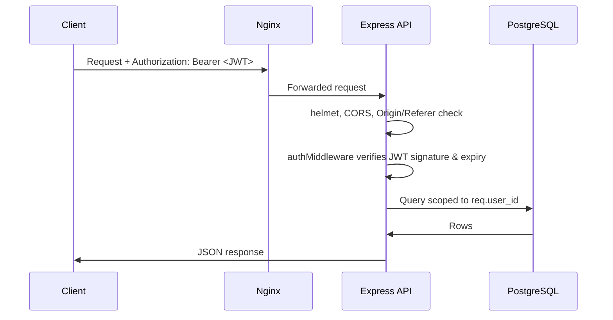

# 🏗️ Script Labs App - System Architecture V2.0

## 📋 Document Information

- **Version**: 2.0 (rewritten to match `backend/server.js` and actual deployment)
- **Date**: 13 September 2026
- **Status**: Current / Authoritative
- **Related**: [PRD V2.0](./PRD_Script_Labs_V2.md), [Database Architecture](./DATABASE_ARCHITECTURE_V2.md), [Deployment Guide](./DEPLOYMENT_GUIDE.md)

---

## 🎯 Architecture Overview

Script Labs is a deliberately simple, **monolithic** Node.js/Express API deployed on a single VPS. There is no microservices split, no managed cloud database, no cache layer, and no frontend served by this repository — the goal is a realistic-but-small target for QA practice, not a scalable production system.

### High-Level Architecture


```mermaid
graph TB
    subgraph "Client"
        POSTMAN[Postman / Automation Scripts]
        LOADTEST[Load Test Tools - k6/JMeter/Artillery]
    end

    subgraph "Vultr VPS"
        NGINX[Nginx - reverse proxy + SSL]
        PM2[PM2 process manager]
        API[Express.js API]
        PG[(Self-hosted PostgreSQL)]
    end

    POSTMAN --> NGINX
    LOADTEST --> NGINX
    NGINX --> PM2
    PM2 --> API
    API --> PG
```

---

## 🏛️ Layered View

### 1. Reverse Proxy / Edge

```
🚪 Nginx
├── TLS termination (Let's Encrypt via certbot)
├── Forwards X-Forwarded-For / X-Real-IP (used by the rate limiter's key generator)
└── Proxies to the Node.js process on localhost
```

### 2. Application Layer (`backend/`)

```
⚙️ Express App (server.js)
├── helmet (security headers, CSP)
├── custom Origin/Referer check (CSRF hardening for state-changing requests)
├── cors (allow-listed origins)
├── body-parser (JSON, 10mb limit)
├── sanitize (basic HTML-tag stripping middleware)
├── /api/auth  → authRoutes.js  (register, login, logout, me, verify-token)
├── /api/labs  → labRoutes.js   (CRUD + search, all behind authMiddleware)
├── /api-docs  → Swagger UI (serves openapi-spec.json)
├── /health    → health check
└── errorHandler (centralized, last middleware)
```

### 3. Data Access Layer

```
📊 backend/db.js
└── single pg.Pool → self-hosted PostgreSQL (see DATABASE_ARCHITECTURE_V2.md)
```

### 4. Cross-Cutting Middleware

```
🛡️ Security & Validation
├── Joi-based validation (backend/middlewares/validation.js)
├── express-rate-limit (backend/middlewares/rateLimiter.js) — auth endpoints only
├── JWT verification (backend/middlewares/authMiddleware.js)
└── centralized error handling (backend/middlewares/errorHandler.js)
```

There is **no** Supabase, Redis, email service, Telegram bot, or WebSocket layer inside the running application. (A Telegram bot script exists under `telegram-bot/` in this repository, but it is a CI/test-notification utility run separately — it is not part of the API's runtime architecture.)

---

## 🔐 Security Architecture

### Request Flow for a Protected Endpoint


```mermaid
sequenceDiagram
    participant C as Client
    participant NGX as Nginx
    participant API as Express API
    participant DB as PostgreSQL

    C->>NGX: Request + Authorization: Bearer <JWT>
    NGX->>API: Forwarded request
    API->>API: helmet, CORS, Origin/Referer check
    API->>API: authMiddleware verifies JWT signature & expiry
    API->>DB: Query scoped to req.user_id
    DB->>API: Rows
    API->>C: JSON response
```

### Security Layers (as actually implemented)

```
🛡️ Security Stack
├── Transport: HTTPS via Nginx + Let's Encrypt
├── Headers: Helmet (CSP restricted to self + Google Fonts, no unsafe-inline)
├── CSRF hardening: custom Origin/Referer allow-list check on state-changing requests
├── Auth: stateless JWT (HS256), 24h expiry, bcrypt-hashed passwords (cost 12)
├── Rate limiting: 5 requests/15 min/IP on /api/auth/register and /api/auth/login only
├── Input validation: Joi schemas for body/params
├── SQL: 100% parameterized queries via pg
└── Data isolation: every labs query is scoped by user_id from the JWT
```

---

## 📈 Performance Characteristics (realistic, for test planning)

This app runs on a **single small VPS** with no caching and a default-sized (10-connection) database pool — these are the real constraints QA performance testing should target, not aspirational numbers:

```
🎯 Known Constraints
├── bcrypt (cost 12) makes /login and /register CPU-bound and the slowest endpoints by design
├── Default pg.Pool max = 10 connections — a realistic concurrency ceiling to probe
├── Search uses ILIKE (no index) — latency should grow with row count
├── /api/labs/* has no rate limit — a legitimate unlimited-traffic surface to load-test
└── Single VPS runs the API, Nginx, and PostgreSQL together — CPU/RAM is shared across all three
```

---

## 🛠️ Technology Stack (actual)

```
⚙️ Backend
├── Node.js (>= 18) + Express.js
├── pg (node-postgres)
├── jsonwebtoken, bcrypt
├── joi (validation)
├── helmet, cors, express-rate-limit
└── swagger-ui-express (serves openapi-spec.json)

🔧 Infra
├── Vultr VPS
├── PM2 (process manager)
├── Nginx (reverse proxy + TLS)
└── PostgreSQL (self-hosted, same VPS)

🧪 Testing (existing in this repo)
└── Jest + Supertest (backend/tests via `npm test`)
```

---

## 🎯 Conclusion

This architecture is intentionally minimal and monolithic: one API process, one database, one server. That's a feature for this project's purpose — it gives QA a small, fully-readable system where the effects of rate limits, connection pool limits, and CPU-bound password hashing are directly observable through black-box testing, without a complex distributed system obscuring the results.

---

**Document Status**: ✅ Complete
**Last Updated**: 13 September 2026
