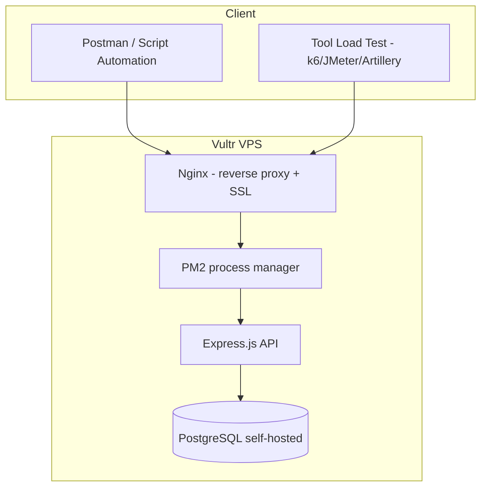
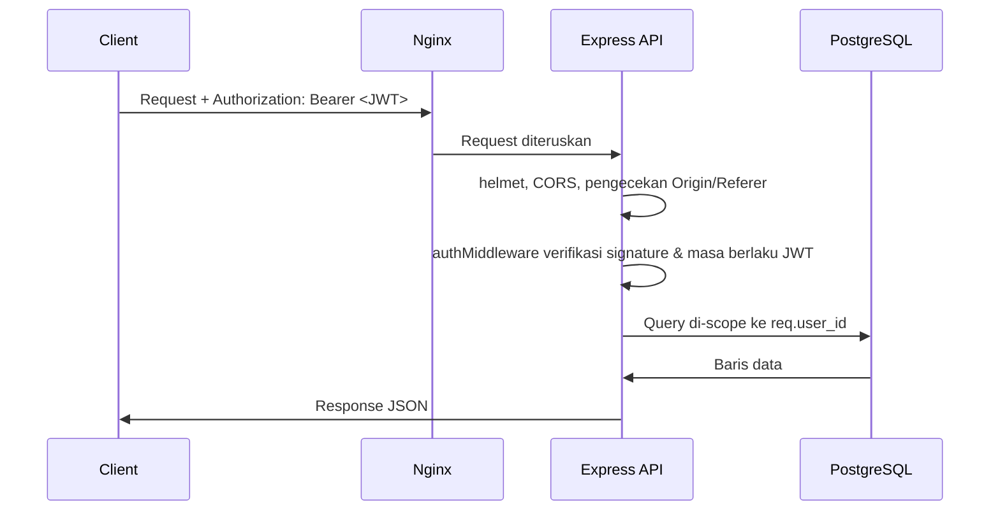

# 🏗️ Script Labs App - Arsitektur Sistem V2.0

## 📋 Informasi Dokumen

- **Versi**: 2.0 (ditulis ulang agar sesuai dengan `backend/server.js` dan deployment aktual)
- **Tanggal**: 13 September 2026
- **Status**: Aktif / Acuan Utama
- **Terkait**: [PRD V2.0](./PRD_Script_Labs_V2.md), [Arsitektur Database](./DATABASE_ARCHITECTURE_V2.md), [Panduan Deployment](./DEPLOYMENT_GUIDE.md)

---

## 🎯 Gambaran Arsitektur

Script Labs sengaja dibuat sebagai API Node.js/Express **monolitik** yang sederhana, di-deploy di satu VPS. Tidak ada pemisahan microservices, tidak ada database cloud terkelola, tidak ada layer cache, dan tidak ada frontend yang disajikan oleh repository ini — tujuannya adalah target latihan QA yang realistis-tapi-kecil, bukan sistem produksi yang scalable.

### Arsitektur Tingkat Tinggi


```mermaid
graph TB
    subgraph "Client"
        POSTMAN[Postman / Script Automation]
        LOADTEST[Tool Load Test - k6/JMeter/Artillery]
    end

    subgraph "Vultr VPS"
        NGINX[Nginx - reverse proxy + SSL]
        PM2[PM2 process manager]
        API[Express.js API]
        PG[(PostgreSQL self-hosted)]
    end

    POSTMAN --> NGINX
    LOADTEST --> NGINX
    NGINX --> PM2
    PM2 --> API
    API --> PG
```

---

## 🏛️ Tampilan Berlapis

### 1. Reverse Proxy / Edge

```
🚪 Nginx (opsional di belakang Cloudflare)
├── Terminasi TLS (Let's Encrypt via certbot)
├── Meneruskan header CF-Connecting-IP (jika lewat Cloudflare) / X-Forwarded-For / X-Real-IP
│   (dipakai oleh key generator rate limiter untuk resolusi IP client yang akurat)
└── Proxy ke proses Node.js di localhost
```

### 2. Application Layer (`backend/`)

```
⚙️ Express App (server.js)
├── helmet (security header, CSP)
├── pengecekan Origin/Referer kustom (pengerasan CSRF untuk request yang mengubah state)
├── cors (origin yang di-allow-list)
├── body-parser (JSON, limit 10mb)
├── sanitize (middleware penghapus tag HTML dasar)
├── /api/auth  → authRoutes.js  (register, login, logout, me, verify-token)
├── /api/labs  → labRoutes.js   (CRUD + search, semua di belakang authMiddleware)
├── /api-docs  → Swagger UI (menyajikan openapi-spec.json)
├── /health    → health check
└── errorHandler (terpusat, middleware terakhir)
```

### 3. Data Access Layer

```
📊 backend/db.js
└── satu pg.Pool → PostgreSQL self-hosted (lihat DATABASE_ARCHITECTURE_V2.md)
```

### 4. Middleware Lintas-Cutting

```
🛡️ Keamanan & Validasi
├── Validasi berbasis Joi (backend/middlewares/validation.js)
├── express-rate-limit (backend/middlewares/rateLimiter.js) — hanya endpoint auth
├── Verifikasi JWT (backend/middlewares/authMiddleware.js)
└── Error handling terpusat (backend/middlewares/errorHandler.js)
```

Tidak ada Supabase, Redis, email service, Telegram bot, atau layer WebSocket di dalam aplikasi yang berjalan. (Ada script bot Telegram di folder `telegram-bot/` dalam repository ini, tapi itu utilitas notifikasi CI/test yang dijalankan terpisah — bukan bagian dari arsitektur runtime API.)

---

## 🔐 Arsitektur Keamanan

### Alur Request untuk Endpoint Terproteksi


```mermaid
sequenceDiagram
    participant C as Client
    participant NGX as Nginx
    participant API as Express API
    participant DB as PostgreSQL

    C->>NGX: Request + Authorization: Bearer <JWT>
    NGX->>API: Request diteruskan
    API->>API: helmet, CORS, pengecekan Origin/Referer
    API->>API: authMiddleware verifikasi signature & masa berlaku JWT
    API->>DB: Query di-scope ke req.user_id
    DB->>API: Baris data
    API->>C: Response JSON
```

### Lapisan Keamanan (sesuai implementasi nyata)

```
🛡️ Security Stack
├── Transport: HTTPS via Nginx + Let's Encrypt
├── Header: Helmet (CSP dibatasi ke self + Google Fonts, tanpa unsafe-inline)
├── Pengerasan CSRF: pengecekan allow-list Origin/Referer kustom pada request pengubah state
├── Auth: JWT stateless (HS256), kedaluwarsa 24 jam, password di-hash bcrypt (cost 12)
├── Rate limiting: 5 request/15 menit/IP hanya pada /api/auth/register dan /api/auth/login
├── Validasi input: skema Joi untuk body/params
├── SQL: 100% parameterized query via pg
└── Isolasi data: setiap query labs di-scope oleh user_id dari JWT
```

---

## 📈 Karakteristik Performa (realistis, untuk perencanaan test)

Aplikasi ini berjalan di **satu VPS kecil** tanpa caching dan dengan connection pool database berukuran default (10 koneksi) — inilah batasan nyata yang seharusnya menjadi target performance testing QA, bukan angka-angka aspirasional:

```
🎯 Batasan yang Diketahui
├── bcrypt (cost 12) membuat /login dan /register CPU-bound dan menjadi endpoint paling lambat, memang disengaja
├── Default pg.Pool max = 10 koneksi — batas konkurensi realistis untuk diuji
├── Pencarian memakai ILIKE (tanpa index) — latensi seharusnya bertambah seiring jumlah baris
├── /api/labs/* tidak punya rate limit — permukaan traffic tak terbatas yang sah untuk di-load-test
└── Satu VPS menjalankan API, Nginx, dan PostgreSQL bersamaan — CPU/RAM dibagi di antara ketiganya
```

---

## 🛠️ Technology Stack (aktual)

```
⚙️ Backend
├── Node.js (>= 18) + Express.js
├── pg (node-postgres)
├── jsonwebtoken, bcrypt
├── joi (validasi)
├── helmet, cors, express-rate-limit
└── swagger-ui-express (menyajikan openapi-spec.json)

🔧 Infrastruktur
├── Vultr VPS
├── PM2 (process manager)
├── Nginx (reverse proxy + TLS), opsional di belakang Cloudflare
└── PostgreSQL (self-hosted, VPS yang sama)

🧪 Testing (sudah ada di repository ini)
└── Jest + Supertest (backend/tests via `npm test`)
```

---

## 🎯 Kesimpulan

Arsitektur ini sengaja dibuat minimal dan monolitik: satu proses API, satu database, satu server. Ini justru fitur untuk tujuan proyek ini — memberi QA sistem kecil yang bisa dibaca sepenuhnya, di mana efek dari rate limit, batas connection pool, dan hashing password yang CPU-bound bisa langsung diamati lewat black-box testing, tanpa sistem terdistribusi yang kompleks mengaburkan hasilnya.

---

**Status Dokumen**: ✅ Lengkap
**Terakhir Diperbarui**: 13 September 2026
